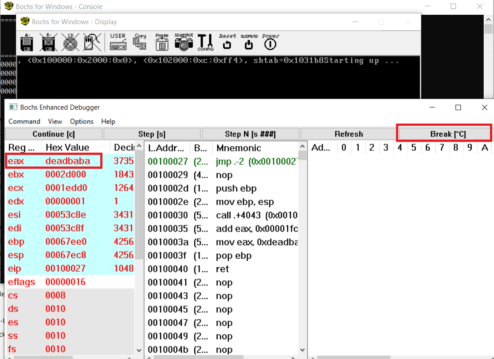
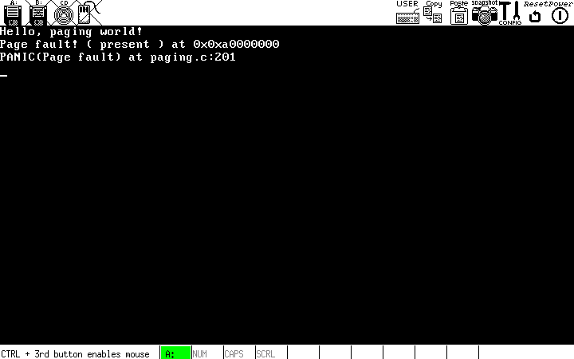
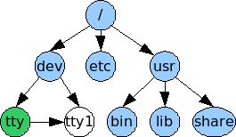

# x86 OS development using Bochs emulator (x86osdev)

**Prerequisites**: You need to know x86 assembly, C, GCC inline ASM, basic Linux and Windows cmd usage.

# Index

- [x86 OS development using Bochs emulator (x86osdev)](#x86-os-development-using-bochs-emulator-x86osdev)
- [Index](#index)
- [Install Bochs](#install-bochs)
- [Usage and Debug](#usage-and-debug)
- [Bochs Software Magic Breakpoint](#bochs-software-magic-breakpoint)
- [Bochs Input and Output debugger macros - BochsConsolePrintChar and BochsBreak](#bochs-input-and-output-debugger-macros---bochsconsoleprintchar-and-bochsbreak)
- [Advanced Bochs debugging](#advanced-bochs-debugging)
- [How to modify a project - optional step](#how-to-modify-a-project---optional-step)
  - [Windows](#windows)
  - [Debian based](#debian-based)
  - [Compilation normal projects](#compilation-normal-projects)
  - [Compilation initrd projects](#compilation-initrd-projects)
  - [Update floppy.img](#update-floppyimg)
- [boot code - bochs/x86osdev/boot_code/floppy.img](#boot-code---bochsx86osdevboot_codefloppyimg)
  - [Understanding the boot code](#understanding-the-boot-code)
  - [Multiboot](#multiboot)
  - [Back to the code again](#back-to-the-code-again)
  - [Adding some C code](#adding-some-c-code)
  - [C code](#c-code)
  - [More info](#more-info)
- [Screen - bochs/x86osdev/screen/floppy.img](#screen---bochsx86osdevscreenfloppyimg)
  - [Monitor code](#monitor-code)
  - [Moving the cursor](#moving-the-cursor)
  - [Scrolling the screen](#scrolling-the-screen)
  - [Writing a character to the screen](#writing-a-character-to-the-screen)
  - [Clearing the screen](#clearing-the-screen)
  - [Writing a string](#writing-a-string)
  - [Summary](#summary)
  - [Extensions](#extensions)
  - [More info](#more-info-1)
- [GDT and IDT - bochs/x86osdev/gdt_idt/floppy.img](#gdt-and-idt---bochsx86osdevgdt_idtfloppyimg)
  - [GDT - Global Descriptor Table](#gdt---global-descriptor-table)
  - [descriptor_tables.h](#descriptor_tablesh)
  - [descriptor_tables.c](#descriptor_tablesc)
  - [IDT - Interrupt Descriptor Table](#idt---interrupt-descriptor-table)
  - [Faults, traps and exceptions](#faults-traps-and-exceptions)
  - [descriptor_tables.h](#descriptor_tablesh-1)
  - [descriptor_tables.c](#descriptor_tablesc-1)
  - [interrupt.s](#interrupts)
  - [isr.c](#isrc)
  - [isr.h](#isrh)
  - [Testing it out](#testing-it-out)
  - [More info](#more-info-2)
- [IRQs and PIT - bochs/x86osdev/irqs_and_the_pit/floppy.img](#irqs-and-pit---bochsx86osdevirqs_and_the_pitfloppyimg)
  - [IRQ - Interrupt ReQuests](#irq---interrupt-requests)
  - [isr.h](#isrh-1)
  - [isr.c](#isrc-1)
  - [PIT - Programmable Interval Timer](#pit---programmable-interval-timer)
  - [More info](#more-info-3)
- [Paging - bochs/x86osdev/paging/floppy.img](#paging---bochsx86osdevpagingfloppyimg)
  - [Virtual memory](#virtual-memory)
  - [Paging as a concretion of virtual memory](#paging-as-a-concretion-of-virtual-memory)
  - [Page entries](#page-entries)
  - [Page directories and tables](#page-directories-and-tables)
  - [Enabling paging](#enabling-paging)
  - [Page faults](#page-faults)
  - [Putting it into practice](#putting-it-into-practice)
  - [Simple memory management with placement malloc](#simple-memory-management-with-placement-malloc)
  - [Required definitions](#required-definitions)
  - [Frame allocation](#frame-allocation)
  - [Paging code finally](#paging-code-finally)
  - [page fault handler](#page-fault-handler)
  - [Testing](#testing)
  - [More info](#more-info-4)
- [Heap - bochs/x86osdev/heap/floppy.img](#heap---bochsx86osdevheapfloppyimg)
  - [Data structure description](#data-structure-description)
  - [Allocation](#allocation)
  - [Deallocation](#deallocation)
  - [Pseudocode](#pseudocode)
  - [Implementing an ordered list](#implementing-an-ordered-list)
  - [ordered_array.h](#ordered_arrayh)
  - [ordered_map.c](#ordered_mapc)
  - [kheap.h](#kheaph)
  - [kheap.c](#kheapc)
  - [Expansion and contraction](#expansion-and-contraction)
  - [Allocation](#allocation-1)
  - [Freeing](#freeing)
  - [paging.c](#pagingc)
  - [Testing](#testing-1)
  - [More info](#more-info-5)
- [VFS and initrd - bochs/x86osdev/vfs_and_initrd/floppy.img](#vfs-and-initrd---bochsx86osdevvfs_and_initrdfloppyimg)
  - [VFS - Virtual File System](#vfs---virtual-file-system)
  - [Mountpoints](#mountpoints)
  - [fs.h](#fsh)
  - [fs.c](#fsc)
  - [Initial Ramdisk](#initial-ramdisk)
  - [My own solution](#my-own-solution)
  - [Filesystem generator](#filesystem-generator)
  - [Integrating it in to your own OS](#integrating-it-in-to-your-own-os)
  - [initrd.h](#initrdh)
  - [initrd.c](#initrdc)
  - [Loading initrd as a multiboot module](#loading-initrd-as-a-multiboot-module)
  - [Testing it out](#testing-it-out-1)
  - [More info](#more-info-6)
- [Multitasking - bochs/x86osdev/multitasking/floppy.img](#multitasking---bochsx86osdevmultitaskingfloppyimg)
  - [Cloning an address space](#cloning-an-address-space)
  - [Cloning a directory](#cloning-a-directory)
  - [Cloning a table](#cloning-a-table)
  - [Copying a physical frame](#copying-a-physical-frame)
  - [Creating a new stack](#creating-a-new-stack)
  - [Actual multitasking code](#actual-multitasking-code)
  - [Switching tasks](#switching-tasks)
  - [Testing](#testing-2)
  - [Summary](#summary-1)
  - [More info](#more-info-7)
- [User Mode (and syscalls) - bochs/x86osdev/user_mode/floppy.img](#user-mode-and-syscalls---bochsx86osdevuser_modefloppyimg)
  - [Switching to user mode](#switching-to-user-mode)
  - [task.c](#taskc)
  - [Something to watch out for](#something-to-watch-out-for)
  - [System calls](#system-calls)
  - [Task State Segment](#task-state-segment)
  - [descriptor_tables.h](#descriptor_tablesh-2)
  - [descriptor_tables.c](#descriptor_tablesc-2)
  - [gdt.s](#gdts)
  - [System call interface](#system-call-interface)
  - [syscall.h](#syscallh)
  - [syscall.c](#syscallc)
  - [Helper macros](#helper-macros)
  - [What happens when a an interrupt occurs in user mode?](#what-happens-when-a-an-interrupt-occurs-in-user-mode)
  - [Testing](#testing-3)
  - [More info](#more-info-8)
- [Multi core startup - bochs/x86osdev/multi_core_startup/floppy.img](#multi-core-startup---bochsx86osdevmulti_core_startupfloppyimg)
  - [Waking the APs](#waking-the-aps)
  - [Initializing and differentiating the APs](#initializing-and-differentiating-the-aps)
  - [Final notes](#final-notes)
  - [Testing](#testing-4)
  - [Interruptions in multi core](#interruptions-in-multi-core)
  - [More info](#more-info-9)
- [xv6 - bochs/x86osdev/xv6_dregmod/](#xv6---bochsx86osdevxv6_dregmod)
  - [Try it](#try-it)
  - [Debugging with symbols](#debugging-with-symbols)
  - [Compilation and modification](#compilation-and-modification)
  - [More info](#more-info-10)
- [Changelog](#changelog)
  - [New chapters](#new-chapters)
- [More info](#more-info-11)

# Install Bochs
For Windows all are included, just download this repo:
* https://github.com/therealdreg/x86osdev/archive/refs/heads/main.zip

For Linux you must install Bochs with debugger gui support + smp (--enable-smp, --enable-debugger and --enable-debugger-gui):
* https://bochs.sourceforge.io/doc/docbook/user/compiling.html

# Usage and Debug

**WARNING**: wait and be patient, Bochs is slow

1. Copy **bochs/x86osdev/Project/floppy.img** to **bochs/**
2. Go to **bochs/**
3. run **bochsdbg.bat** (For Linux **./bochsdbg.sh**)
4. Click Start
5. Click Continue (**First Breakpoint**):


6. When **"Magic Breakpoint"** text appears click Continue again (**Second Magic Breakpoint**):


**IMPORTANT**: When you read **"Run"** or **"Run Bochs"** it means Run bochs from **bochsdbg.bat** (For Linux **./bochsdbg.sh**) script. 

With **first breakpoint** its possible debug bootloader code from start.

With **second magic breakpoint** its possible debug kernel code from start.

Debug commands: https://bochs.sourceforge.io/doc/docbook/user/internal-debugger.html

# Bochs Software Magic Breakpoint

From our OS Code:

GCC:
```
asm volatile ("xchgw %bx, %bx");
```

NASM:
```
xchg bx, bx
```

# Bochs Input and Output debugger macros - BochsConsolePrintChar and BochsBreak

From our OS Code:

```
//outputs a character to the debug console
#define BochsConsolePrintChar(c) outportb(0xe9, c)
//stops simulation and breaks into the debug console
#define BochsBreak() outportw(0x8A00,0x8A00); outportw(0x8A00,0x08AE0);
```

# Advanced Bochs debugging

Commands supported by port 0x8A00

- **0x8A00**: Used to enable the device. Any I/O to the debug module before this command is sent is sent will simply be ignored.
- **0x8A01**: Selects register 0: Memory monitoring range start address (inclusive)
- **0x8A02**: Selects register 1: Memory monitoring range end address (exclusive)
- **0x8A80**: Enable address range memory monitoring as indicated by register 0 and 1 and clears both registers
- **0x8AE0**: Return to Debugger Prompt. If the debugger is enabled (via --enable-debugger), sending 0x8AE0 to port 0x8A00 after the device has been enabled will return the Bochs to the debugger prompt. Basically the same as doing CTRL+C.
- **0x8AE2**: Instruction Trace Disable. If the debugger is enabled (via --enable-debugger), sending 0x8AE2 to port 0x8A00 after the device has been enabled will disable instruction tracing
- **0x8AE3**: Instruction Trace Enable. If the debugger is enabled (via --enable-debugger), sending 0x8AE3 to port 0x8A00 after the device has been enabled will enable instruction tracing
- **0x8AE4**: Register Trace Disable. If the debugger is enabled (via --enable-debugger), sending 0x8AE4 to port 0x8A00 after the device has been enabled will disable register tracing.
- **0x8AE5**: Register Trace Enable. If the debugger is enabled (via --enable-debugger), sending 0x8AE5 to port 0x8A00 after the device has been enabled will enable register tracing. This currently output the value of all the registers for each instruction traced. Note: instruction tracing must be enabled to view the register tracing
- **0x8AFF**: Disable the I/O interface to the debugger and the memory monitoring functions. Note: all accesses must be done using word. Note: reading this register will return 0x8A00 if currently activated, otherwise 0

More info and examples: https://bochs.sourceforge.io/doc/docbook/development/debugger-advanced.html

# How to modify a project - optional step

1. Modify a project **bochs/x86osdev/Project/src**
2. After a modification you must recompile the project

## Windows

1. Install WSL2, open cmd as Administrator:
```
wsl --install
```
2. Reboot
3. Open WSL console:
```
apt-get update
apt-get install nasm build-essential gcc-multilib
```

## Debian based

```
apt-get update
apt-get install nasm build-essential gcc-multilib
```

## Compilation normal projects

Go to **bochs/x86osdev/Project/src/**
```
make clean
make
```

## Compilation initrd projects
1. Go to **bochs/x86osdev/Project/src/**
```
make clean
make
```

2. Go to **bochs/x86osdev/Project/**
```
make clean
make
./make_initrd.sh
```

## Update floppy.img

After compilation you must update floppy.img

Go to **bochs/x86osdev/Project/**
```
./update_image.sh
```

**WARNING**: for **xv6 project** update_image.sh will update xv6.img, fs.img and kernel.sym

# boot code - bochs/x86osdev/boot_code/floppy.img
OK, It's time for some code! Although the brunt of our kernel will be written in C, there are certain things we just must use assembly for. One of those things is the initial boot code.

Here we go:
```
;
; boot.s -- Kernel start location. Also defines multiboot header.
; Based on Bran's kernel development tutorial file start.asm
;

MBOOT_PAGE_ALIGN    equ 1<<0    ; Load kernel and modules on a page boundary
MBOOT_MEM_INFO      equ 1<<1    ; Provide your kernel with memory info
MBOOT_HEADER_MAGIC  equ 0x1BADB002 ; Multiboot Magic value
; NOTE: We do not use MBOOT_AOUT_KLUDGE. It means that GRUB does not
; pass us a symbol table.
MBOOT_HEADER_FLAGS  equ MBOOT_PAGE_ALIGN | MBOOT_MEM_INFO
MBOOT_CHECKSUM      equ -(MBOOT_HEADER_MAGIC + MBOOT_HEADER_FLAGS)


[BITS 32]                       ; All instructions should be 32-bit.

[GLOBAL mboot]                  ; Make 'mboot' accessible from C.
[EXTERN code]                   ; Start of the '.text' section.
[EXTERN bss]                    ; Start of the .bss section.
[EXTERN end]                    ; End of the last loadable section.

mboot:
  dd  MBOOT_HEADER_MAGIC        ; GRUB will search for this value on each
                                ; 4-byte boundary in your kernel file
  dd  MBOOT_HEADER_FLAGS        ; How GRUB should load your file / settings
  dd  MBOOT_CHECKSUM            ; To ensure that the above values are correct
   
  dd  mboot                     ; Location of this descriptor
  dd  code                      ; Start of kernel '.text' (code) section.
  dd  bss                       ; End of kernel '.data' section.
  dd  end                       ; End of kernel.
  dd  start                     ; Kernel entry point (initial EIP).

[GLOBAL start]                  ; Kernel entry point.
[EXTERN main]                   ; This is the entry point of our C code

start:
  push    ebx                   ; Load multiboot header location

  ; Execute the kernel:
  cli                         ; Disable interrupts.
  call main                   ; call our main() function.
  jmp $                       ; Enter an infinite loop, to stop the processor
                              ; executing whatever rubbish is in the memory
                              ; after our kernel!
```

## Understanding the boot code

There's actually only a few lines of code in that snippet:

```
push ebx
cli
call main
jmp $
```

The rest of it is all to do with the multiboot header.

## Multiboot

Multiboot is a standard to which GRUB expects a kernel to comply. It is a way for the bootloader to

1. Know exactly what environment the kernel wants/needs when it boots.
2. Allow the kernel to query the environment it is in.

So, for example, if your kernel needs to be loaded in a specific VESA mode (which is a bad idea, by the way), you can inform the bootloader of this, and it can take care of it for you.

To make your kernel multiboot compatible, you need to add a header structure somewhere in your kernel (Actually, the header must be in the first 4KB of the kernel). Usefully, there is a NASM command that lets us embed specific constants in our code - 'dd'. These lines:

```
dd MBOOT_HEADER_MAGIC
dd MBOOT_HEADER_FLAGS
dd MBOOT_CHECKSUM
dd mboot
dd code
dd bss
dd end
dd start
```

Do just that. The MBOOT_* constants are defined above.

- **MBOOT_HEADER_MAGIC**: A magic number. This identifies the kernel as multiboot-compatible.
- **MBOOT_HEADER_FLAGS**: A field of flags. We ask for GRUB to page-align all kernel sections (MBOOT_PAGE_ALIGN) and also to give us some memory information (MBOOT_MEM_INFO). Note that some tutorials also use MBOOT_AOUT_KLUDGE. As we are using the ELF file format, this hack is not necessary, and adding it stops GRUB giving you your symbol table when you boot up
- **MBOOT_CHECKSUM**: This field is defined such that when the magic number, the flags and this are added together, the total must be zero. It is for error checking.
- **mboot**: The address of the structure that we are currently writing. GRUB uses this to tell if we are expecting to be relocated.
- **code,bss,end,start**: These symbols are all defined by the linker. We use them to tell GRUB where the different sections of our kernel can be located.

On bootup, GRUB will load a pointer to another information structure into the EBX register. This can be used to query the environment GRUB set up for us.

## Back to the code again

So, immediately on bootup, the asm snippet tells the CPU to push the contents of EBX onto the stack (remember that EBX now contains a pointer to the multiboot information structure), disable interrupts (CLI), call our 'main' C function (which we haven't defined yet), then enter an infinite loop.

All is good, but the code won't link yet. We haven't defined main()!

## Adding some C code

Interfacing C code and assembly is dead easy. You just have to know the calling convention used. GCC on x86 uses the cdecl calling convention:

- All parameters to a function are passed on the stack.
- The parameters are pushed right-to-left.
- The return value of a function is returned in EAX.

...so the function call:

```
d = func(a, b, c);
```

Becomes:

```
push [c]
push [b]
push [a]
call func
mov [d], eax
```

See? nothing to it! So, you can see that in our asm snippet above, that 'push ebx' is actually passing the value of ebx as a parameter to the function main().

## C code

```
// main.c -- Defines the C-code kernel entry point, calls initialisation routines.
// Made for JamesM's tutorials

int main(struct multiboot *mboot_ptr)
{
  // All our initialisation calls will go in here.
  return 0xDEADBABA;
}
```

Here's our first incarnation of the main() function. As you can see, we've made it take one parameter - a pointer to a multiboot struct. We'll define that later (we don't actually need to define it for the code to compile!).

All the function does is return a constant - 0xDEADBABA. That constant is unusual enough that it should stand out at you when we run the program in a second.

Copy floppy.img from project_dir/ to bochs/ directory and run Bochs debugger.

You'll see GRUB for a few seconds then the kernel will run. It doesn't actually do anything, so it'll just freeze, saying 'starting up...'.

Press **Break [^C]** and look **EAX** value



Also, if you open **bochsout.txt**, at the bottom you should see something like:

```
00074621500i[CPU  ] | EAX=deadbaba  EBX=0002d000  ECX=0001edd0 EDX=00000001
00074621500i[CPU  ] | ESP=00067ec8  EBP=00067ee0  ESI=00053c76 EDI=00053c77
00074621500i[CPU  ] | IOPL=0 id vip vif ac vm rf nt of df if tf sf zf af pf cf
00074621500i[CPU  ] | SEG selector     base    limit G D
00074621500i[CPU  ] | SEG sltr(index|ti|rpl)     base    limit G D
00074621500i[CPU  ] |  CS:0008( 0001| 0|  0) 00000000 000fffff 1 1
00074621500i[CPU  ] |  DS:0010( 0002| 0|  0) 00000000 000fffff 1 1
00074621500i[CPU  ] |  SS:0010( 0002| 0|  0) 00000000 000fffff 1 1
00074621500i[CPU  ] |  ES:0010( 0002| 0|  0) 00000000 000fffff 1 1
00074621500i[CPU  ] |  FS:0010( 0002| 0|  0) 00000000 000fffff 1 1
00074621500i[CPU  ] |  GS:0010( 0002| 0|  0) 00000000 000fffff 1 1
00074621500i[CPU  ] | EIP=00100027 (00100027)
00074621500i[CPU  ] | CR0=0x00000011 CR1=0 CR2=0x00000000
00074621500i[CPU  ] | CR3=0x00000000 CR4=0x00000000
00074621500i[CPU  ] >> jmp .+0xfffffffe (0x00100027) : EBFE
```

Notice what the value of EAX is? 0xDEADBABA - the return value of main(). Congratulations, you now have a multiboot compatible assembly trampoline, and you're ready to start printing to the screen!


## More info

- https://wiki.osdev.org/GRUB
- https://wiki.osdev.org/Multiboot
- https://wiki.osdev.org/GRUB_Legacy
- https://wiki.osdev.org/Bootloader
- https://wiki.osdev.org/Rolling_Your_Own_Bootloader
- https://wiki.osdev.org/Bare_Bones
- https://wiki.osdev.org/Category:Babystep

# Screen - bochs/x86osdev/screen/floppy.img

So, now that we have a 'kernel' that can run and stick itself into an infinite loop, it's time to get something interesting appearing on the screen. Along with serial I/O, the monitor will be your most important ally in the debugging battle.

Your kernel gets booted by GRUB in text mode. That is, it has available to it a framebuffer (area of memory) that controls a screen of characters (not pixels) 80 wide by 25 high. This will be the mode your kernel will operate in until your get into the world of VESA (which will not be covered in this tutorial).

The area of memory known as the framebuffer is accessible just like normal RAM, at address 0xB8000. It is important to note, however, that it is not actually normal RAM. It is part of the VGA controller's dedicated video memory that has been memory-mapped via hardware into your linear address space. This is an important distinction.

The framebuffer is just an array of 16-bit words, each 16-bit value representing the display of one character. The offset from the start of the framebuffer of the word that specifies a character at position x, y is:

```
(y * 80 + x) * 2
```

What's important to note is that the '* 2' is there only because each element is 2 bytes (16 bits) long. If you're indexing an array of 16-bit values, for example, your index would just be y*80+x.

In ASCII (unicode is not supported in text mode), 8 bits are used to represent a character. That gives us 8 more bits which are unused. The VGA hardware uses these to designate foreground and background colours (4 bits each). The splitting of this 16-bit value is shown in the diagram to the right.

4 bits for a colour code gives us 15 possible colours we can display:

- 0: black 
- 1: blue 
- 2: green 
- 3: cyan 
- 4: red
- 5: magenta 
- 6: brown
- 7: light grey 
- 8: dark grey 
- 9: light blue 
- 10: light green 
- 11: light cyan 
- 12: light red 
- 13: light magneta 
- 14: light brown
- 15: white

The VGA controller also has some ports on the main I/O bus, which you can use to send it specific instructions. (Among others) it has a control register at 0x3D4 and a data register at 0x3D5. We will use these to instruct the controller to update it's cursor position (the flashy underbar thing that tells you where your next character will go).

Word format:


Firstly, we need a few more commonly-used global functions. common.c and common.h include functions for writing to and reading from the I/O bus, and some typedefs that will make it easier for us to write portable code. They are also the ideal place to put functions such as memcpy/memset etc. I have left them for you to implement! :)

```
// common.h -- Defines typedefs and some global functions.
// From JamesM's kernel development tutorials.

#ifndef COMMON_H
#define COMMON_H

// Some nice typedefs, to standardise sizes across platforms.
// These typedefs are written for 32-bit X86.
typedef unsigned int   u32int;
typedef          int   s32int;
typedef unsigned short u16int;
typedef          short s16int;
typedef unsigned char  u8int;
typedef          char  s8int;

void outb(u16int port, u8int value);
u8int inb(u16int port);
u16int inw(u16int port);

#endif
```

```
// common.c -- Defines some global functions.
// From JamesM's kernel development tutorials.

#include "common.h"

// Write a byte out to the specified port.
void outb(u16int port, u8int value)
{
    asm volatile ("outb %1, %0" : : "dN" (port), "a" (value));
}

u8int inb(u16int port)
{
   u8int ret;
   asm volatile("inb %1, %0" : "=a" (ret) : "dN" (port));
   return ret;
}

u16int inw(u16int port)
{
   u16int ret;
   asm volatile ("inw %1, %0" : "=a" (ret) : "dN" (port));
   return ret;
}
```

Disas:
```
001003cc <outb>:
  1003cc:       f3 0f 1e fb             endbr32
  1003d0:       55                      push   ebp
  1003d1:       89 e5                   mov    ebp,esp
  1003d3:       83 ec 08                sub    esp,0x8
  1003d6:       e8 29 0c 00 00          call   101004 <__x86.get_pc_thunk.ax>
  1003db:       05 25 1c 00 00          add    eax,0x1c25
  1003e0:       8b 45 08                mov    eax,DWORD PTR [ebp+0x8]
  1003e3:       8b 55 0c                mov    edx,DWORD PTR [ebp+0xc]
  1003e6:       66 89 45 fc             mov    WORD PTR [ebp-0x4],ax
  1003ea:       89 d0                   mov    eax,edx
  1003ec:       88 45 f8                mov    BYTE PTR [ebp-0x8],al
  1003ef:       0f b7 55 fc             movzx  edx,WORD PTR [ebp-0x4]
  1003f3:       0f b6 45 f8             movzx  eax,BYTE PTR [ebp-0x8]
  1003f7:       ee                      out    dx,al
  1003f8:       90                      nop
  1003f9:       c9                      leave
  1003fa:       c3                      ret

001003fb <inb>:
  1003fb:       f3 0f 1e fb             endbr32
  1003ff:       55                      push   ebp
  100400:       89 e5                   mov    ebp,esp
  100402:       83 ec 14                sub    esp,0x14
  100405:       e8 fa 0b 00 00          call   101004 <__x86.get_pc_thunk.ax>
  10040a:       05 f6 1b 00 00          add    eax,0x1bf6
  10040f:       8b 45 08                mov    eax,DWORD PTR [ebp+0x8]
  100412:       66 89 45 ec             mov    WORD PTR [ebp-0x14],ax
  100416:       0f b7 45 ec             movzx  eax,WORD PTR [ebp-0x14]
  10041a:       89 c2                   mov    edx,eax
  10041c:       ec                      in     al,dx
  10041d:       88 45 ff                mov    BYTE PTR [ebp-0x1],al
  100420:       0f b6 45 ff             movzx  eax,BYTE PTR [ebp-0x1]
  100424:       c9                      leave
  100425:       c3                      ret

00100426 <inw>:
  100426:       f3 0f 1e fb             endbr32
  10042a:       55                      push   ebp
  10042b:       89 e5                   mov    ebp,esp
  10042d:       83 ec 14                sub    esp,0x14
  100430:       e8 cf 0b 00 00          call   101004 <__x86.get_pc_thunk.ax>
  100435:       05 cb 1b 00 00          add    eax,0x1bcb
  10043a:       8b 45 08                mov    eax,DWORD PTR [ebp+0x8]
  10043d:       66 89 45 ec             mov    WORD PTR [ebp-0x14],ax
  100441:       0f b7 45 ec             movzx  eax,WORD PTR [ebp-0x14]
  100445:       89 c2                   mov    edx,eax
  100447:       66 ed                   in     ax,dx
  100449:       66 89 45 fe             mov    WORD PTR [ebp-0x2],ax
  10044d:       0f b7 45 fe             movzx  eax,WORD PTR [ebp-0x2]
  100451:       c9                      leave
  100452:       c3                      ret
```

## Monitor code

A simple header file:

```
// monitor.h -- Defines the interface for monitor.h
// From JamesM's kernel development tutorials.

#ifndef MONITOR_H
#define MONITOR_H

#include "common.h"

// Write a single character out to the screen.
void monitor_put(char c);

// Clear the screen to all black.
void monitor_clear();

// Output a null-terminated ASCII string to the monitor.
void monitor_write(char *c);

#endif // MONITOR_H
```

## Moving the cursor

To move the hardware cursor, we must firstly work out the linear offset of the x,y cursor coordinate. We do this by using the equation above. Next, we have to send this offset to the VGA controller. For some reason, it accepts the 16-bit location as two bytes. We send the controller's command port (0x3D4) the command 14 to tell it we are sending the high byte, then send that byte to port 0x3D5. We then repeat with the low byte, but send the command 15 instead.

```
// Updates the hardware cursor.
static void move_cursor()
{
   // The screen is 80 characters wide...
   u16int cursorLocation = cursor_y * 80 + cursor_x;
   outb(0x3D4, 14);                  // Tell the VGA board we are setting the high cursor byte.
   outb(0x3D5, cursorLocation >> 8); // Send the high cursor byte.
   outb(0x3D4, 15);                  // Tell the VGA board we are setting the low cursor byte.
   outb(0x3D5, cursorLocation);      // Send the low cursor byte.
}
```

## Scrolling the screen

At some point we're going to fill up the screen with text. It would be nice if, when we do that, the screen acted like a terminal and scrolled up one line. Actually, this really isn't very difficult to do:

```
// Scrolls the text on the screen up by one line.
static void scroll()
{

   // Get a space character with the default colour attributes.
   u8int attributeByte = (0 /*black*/ << 4) | (15 /*white*/ & 0x0F);
   u16int blank = 0x20 /* space */ | (attributeByte << 8);

   // Row 25 is the end, this means we need to scroll up
   if(cursor_y >= 25)
   {
       // Move the current text chunk that makes up the screen
       // back in the buffer by a line
       int i;
       for (i = 0*80; i < 24*80; i++)
       {
           video_memory[i] = video_memory[i+80];
       }

       // The last line should now be blank. Do this by writing
       // 80 spaces to it.
       for (i = 24*80; i < 25*80; i++)
       {
           video_memory[i] = blank;
       }
       // The cursor should now be on the last line.
       cursor_y = 24;
   }
}
```

## Writing a character to the screen
Now the code gets a little more complex. But, if you look at it, you'll see that most of it is logic as to where to put the cursor next - there really isn't much difficult there.

```
// Writes a single character out to the screen.
void monitor_put(char c)
{
   // The background colour is black (0), the foreground is white (15).
   u8int backColour = 0;
   u8int foreColour = 15;

   // The attribute byte is made up of two nibbles - the lower being the
   // foreground colour, and the upper the background colour.
   u8int  attributeByte = (backColour << 4) | (foreColour & 0x0F);
   // The attribute byte is the top 8 bits of the word we have to send to the
   // VGA board.
   u16int attribute = attributeByte << 8;
   u16int *location;

   // Handle a backspace, by moving the cursor back one space
   if (c == 0x08 && cursor_x)
   {
       cursor_x--;
   }

   // Handle a tab by increasing the cursor's X, but only to a point
   // where it is divisible by 8.
   else if (c == 0x09)
   {
       cursor_x = (cursor_x+8) & ~(8-1);
   }

   // Handle carriage return
   else if (c == '\r')
   {
       cursor_x = 0;
   }

   // Handle newline by moving cursor back to left and increasing the row
   else if (c == '\n')
   {
       cursor_x = 0;
       cursor_y++;
   }
   // Handle any other printable character.
   else if(c >= ' ')
   {
       location = video_memory + (cursor_y*80 + cursor_x);
       *location = c | attribute;
       cursor_x++;
   }

   // Check if we need to insert a new line because we have reached the end
   // of the screen.
   if (cursor_x >= 80)
   {
       cursor_x = 0;
       cursor_y ++;
   }

   // Scroll the screen if needed.
   scroll();
   // Move the hardware cursor.
   move_cursor();
}
```

See? It's pretty simple! The bit that actually does the writing is here:

```
location = video_memory + (cursor_y*80 + cursor_x);
*location = c | attribute;
```

- Set 'location' to point to the linear address of the word corresponding to the current cursor position (see equation above).
- Set the value at 'location' to be the logical-OR of the character and 'attribute'. Remember that we shifted 'attribute' left 8 bits above, so actually we're just setting 'c' as the lower byte of 'attribute'.

## Clearing the screen

Clearing the screen is also dead easy. Just fill it with loads of spaces:

```
// Clears the screen, by copying lots of spaces to the framebuffer.
void monitor_clear()
{
   // Make an attribute byte for the default colours
   u8int attributeByte = (0 /*black*/ << 4) | (15 /*white*/ & 0x0F);
   u16int blank = 0x20 /* space */ | (attributeByte << 8);

   int i;
   for (i = 0; i < 80*25; i++)
   {
       video_memory[i] = blank;
   }

   // Move the hardware cursor back to the start.
   cursor_x = 0;
   cursor_y = 0;
   move_cursor();
}
```

## Writing a string
```
// Outputs a null-terminated ASCII string to the monitor.
void monitor_write(char *c)
{
   int i = 0;
   while (c[i])
   {
       monitor_put(c[i++]);
   }
}
```

## Summary

If you put all that code together, you can add a couple of lines to your main.c file:

```
monitor_clear();
monitor_write("Hello, world!");
```

Et voila - a text output function! Not bad for a couple of minutes' work, eh?

## Extensions
Apart from implementing memcpy/memset/strlen/strcmp etc, there are a few other functions that will make life easier for you.

```
void monitor_write_hex(u32int n)
{
   // TODO: implement this yourself!
}

void monitor_write_dec(u32int n)
{
   // TODO: implement this yourself!
}
```

The function names should be pretty self explanatory -- writing in hexadecimal really is required if you're going to check the validity of pointers. Decimal is optional but it's nice to see something in base 10 every once in a while!

You could also have a scout at the linux0.1 code - that has an implementation of vsprintf which is quite neat and tidy. You could copy that function then use it to implement printf(), which will make your life a hell of a lot easier when it comes to debugging.

Copy floppy.img from project_dir/ to bochs/ directory and run Bochs debugger.


## More info

- https://wiki.osdev.org/Printing_To_Screen
- https://wiki.osdev.org/Inline_Assembly/Examples
- https://wiki.osdev.org/Inline_Assembly

# GDT and IDT - bochs/x86osdev/gdt_idt/floppy.img

The GDT and the IDT are descriptor tables. They are arrays of flags and bit values describing the operation of either the segmentation system (in the case of the GDT), or the interrupt vector table (IDT).

They are, unfortunately, a little theory-heavy, but bear with it because it'll be over soon!

## GDT - Global Descriptor Table

The x86 architecture has two methods of memory protection and of providing virtual memory - segmentation and paging.

With segmentation, every memory access is evaluated with respect to a segment. That is, the memory address is added to the segment's base address, and checked against the segment's length. You can think of a segment as a window into the address space - The process does not know it's a window, all it sees is a linear address space starting at zero and going up to the segment length.

With paging, the address space is split into (usually 4KB, but this can change) blocks, called pages. Each page can be mapped into physical memory - mapped onto what is called a 'frame'. Or, it can be unmapped. Like this you can create virtual memory spaces.

Both of these methods have their advantages, but paging is much better. Segmentation is, although still usable, fast becoming obsolete as a method of memory protection and virtual memory. In fact, the x86-64 architecture requires a flat memory model (one segment with a base of 0 and a limit of 0xFFFFFFFF) for some of it's instructions to operate properly.

Segmentation is, however, totally in-built into the x86 architecture. It's impossible to get around it. So here we're going to show you how to set up your own Global Descriptor Table - a list of segment descriptors.

As mentioned before, we're going to try and set up a flat memory model. The segment's window should start at 0x00000000 and extend to 0xFFFFFFFF (the end of memory). However, there is one thing that segmentation can do that paging can't, and that's set the ring level.

A ring is a privilege level - zero being the most privileged, and three being the least. Processes in ring zero are said to be running in kernel-mode, or supervisor-mode, because they can use instructions like sti and cli, something which most processes can't. Normally, rings 1 and 2 are unused. They can, technically, access a greater subset of the supervisor-mode instructions than ring 3 can. Some microkernel architectures use these for running server processes, or drivers.

A segment descriptor carries inside it a number representing the ring level it applies to. To change ring levels (which we'll do later on), among other things, we need segments that represent both ring 0 and ring 3.

OK, that was one humungous chunk of theory, lets get into the nitty gritty of implementing this.

One thing I forgot to mention is that GRUB sets a GDT up for you. The problem is that you don't know where that GDT is, or what's in it. So you could accidentally overwrite it, then your computer would triple-fault and reset. Not clever.

In the x86, we have 6 segmentation registers. Each holds an offset into the GDT. They are cs (code segment), ds (data segment), es (extra segment), fs, gs, ss (stack segment). The code segment must reference a descriptor which is set as a 'code segment'. There is a flag for this in the access byte. The rest should all reference a descriptor which is set as a 'data segment'.

Access byte format:


## descriptor_tables.h

A GDT entry looks like this:

```
// This structure contains the value of one GDT entry.
// We use the attribute 'packed' to tell GCC not to change
// any of the alignment in the structure.
struct gdt_entry_struct
{
   u16int limit_low;           // The lower 16 bits of the limit.
   u16int base_low;            // The lower 16 bits of the base.
   u8int  base_middle;         // The next 8 bits of the base.
   u8int  access;              // Access flags, determine what ring this segment can be used in.
   u8int  granularity;
   u8int  base_high;           // The last 8 bits of the base.
} __attribute__((packed));
typedef struct gdt_entry_struct gdt_entry_t;
```

Most of those fields should be self-explanatory. The format of the access byte is given on the right above, and the format of the granularity byte is here on the right.

- **P**: Is segment present? (1 = Yes)
- **DPL**: Descriptor privilege level - Ring 0 - 3.
- **DT**: Descriptor type
- **Type**: Segment type - code segment / data segment.
- **G**: Granularity (0 = 1 byte, 1 = 1kbyte)
- **D**: Operand size (0 = 16bit, 1 = 32bit)
- **0**: Should always be zero.
- **A**: Available for system use (always zero).

To tell the processor where to find our GDT, we have to give it the address of a special pointer structure:

```
struct gdt_ptr_struct
{
   u16int limit;               // The upper 16 bits of all selector limits.
   u32int base;                // The address of the first gdt_entry_t struct.
}
 __attribute__((packed));
typedef struct gdt_ptr_struct gdt_ptr_t;
```

The base is the address of the first entry in our GDT, the limit being the size of the table minus one (the last valid address in the table).

Those struct definitions should go in a header file, descriptor_tables.h, along with a prototype.

```
// Initialisation function is publicly accessible.
void init_descriptor_tables();
```

Granularity byte format:


## descriptor_tables.c

In descriptor_tables.c, we have a few declarations:

```
//
// descriptor_tables.c - Initialises the GDT and IDT, and defines the
// default ISR and IRQ handler.
// Based on code from Bran's kernel development tutorials.
// Rewritten for JamesM's kernel development tutorials.
//

#include "common.h"
#include "descriptor_tables.h"

// Lets us access our ASM functions from our C code.
extern void gdt_flush(u32int);

// Internal function prototypes.
static void init_gdt();
static void gdt_set_gate(s32int,u32int,u32int,u8int,u8int);

gdt_entry_t gdt_entries[5];
gdt_ptr_t   gdt_ptr;
idt_entry_t idt_entries[256];
idt_ptr_t   idt_ptr;
```

Notice the gdt_flush function - this will be defined in an ASM file, and will load our GDT pointer for us.

```
// Initialisation routine - zeroes all the interrupt service routines,
// initialises the GDT and IDT.
void init_descriptor_tables()
{
   // Initialise the global descriptor table.
   init_gdt();
}

static void init_gdt()
{
   gdt_ptr.limit = (sizeof(gdt_entry_t) * 5) - 1;
   gdt_ptr.base  = (u32int)&gdt_entries;

   gdt_set_gate(0, 0, 0, 0, 0);                // Null segment
   gdt_set_gate(1, 0, 0xFFFFFFFF, 0x9A, 0xCF); // Code segment
   gdt_set_gate(2, 0, 0xFFFFFFFF, 0x92, 0xCF); // Data segment
   gdt_set_gate(3, 0, 0xFFFFFFFF, 0xFA, 0xCF); // User mode code segment
   gdt_set_gate(4, 0, 0xFFFFFFFF, 0xF2, 0xCF); // User mode data segment

   gdt_flush((u32int)&gdt_ptr);
}

// Set the value of one GDT entry.
static void gdt_set_gate(s32int num, u32int base, u32int limit, u8int access, u8int gran)
{
   gdt_entries[num].base_low    = (base & 0xFFFF);
   gdt_entries[num].base_middle = (base >> 16) & 0xFF;
   gdt_entries[num].base_high   = (base >> 24) & 0xFF;

   gdt_entries[num].limit_low   = (limit & 0xFFFF);
   gdt_entries[num].granularity = (limit >> 16) & 0x0F;

   gdt_entries[num].granularity |= gran & 0xF0;
   gdt_entries[num].access      = access;
}
```

Lets just analyse that code for a moment. init_gdt initially sets up the gdt pointer structure - the limit is the size of each gdt entry * 5 - we have 5 entries. Why 5? well, we have a code and data segment descriptor for the kernel, code and data segment descriptors for user mode, and a null entry. This must be present, or bad things will happen.

gdt_init then sets up the 5 descriptors, by calling gdt_set_gate. gdt_set_gate just does some severe bit-twiddling and shifting, and should be self-explanatory with a hard stare at it. Notice that the only thing that changes between the 4 segment descriptors is the access byte - 0x9A, 0x92, 0xFA, 0xF2. You can see, if you map out the bits and compare them to the format diagram above, the bits that are changing are the type and DPL fields. DPL is the descriptor privilege level - 3 for user code and 0 for kernel code. Type specifies whether the segment is a code segment or a data segment (the processor checks this often, and can be the source of much frustration).

Finally, we have our ASM function that will write the GDT pointer.

```
[GLOBAL gdt_flush]    ; Allows the C code to call gdt_flush().

gdt_flush:
   mov eax, [esp+4]  ; Get the pointer to the GDT, passed as a parameter.
   lgdt [eax]        ; Load the new GDT pointer

   mov ax, 0x10      ; 0x10 is the offset in the GDT to our data segment
   mov ds, ax        ; Load all data segment selectors
   mov es, ax
   mov fs, ax
   mov gs, ax
   mov ss, ax
   jmp 0x08:.flush   ; 0x08 is the offset to our code segment: Far jump!
.flush:
   ret
```
   
This function takes the first parameter passed to it (in esp+4), loads the value is points to into the GDT (using the lgdt instruction), then loads the segment selectors for the data and code segments. Notice that each GDT entry is 8 bytes, and the kernel code descriptor is the second segment, so it's offset is 0x08. Likewise the kernel data descriptor is the third, so it's offset is 16 = 0x10. Here we move the value 0x10 into the data segment registers ds,es,fd,gs,ss. To change the code segment is slightly different; we must do a far jump. This changes the CS implicitly.

## IDT - Interrupt Descriptor Table

There are times when you want to interrupt the processor. You want to stop it doing what it is doing, and force it to do something different. An example of this is when an timer or keyboard interrupt request (IRQ) fires. An interrupt is like a POSIX signal - it tells you that something of interest has happened. The processor can register 'signal handlers' (interrupt handlers) that deal with the interrupt, then return to the code that was running before it fired. Interrupts can be fired externally, via IRQs, or internally, via the 'int n' instruction. There are very useful reasons for wanting to do fire interrupts from software, but that's for another chapter!

The Interrupt Descriptor Table tells the processor where to find handlers for each interrupt. It is very similar to the GDT. It is just an array of entries, each one corresponding to an interrupt number. There are 256 possible interrupt numbers, so 256 must be defined. If an interrupt occurs and there is no entry for it (even a NULL entry is fine), the processor will panic and reset.

## Faults, traps and exceptions

The processor will sometimes need to signal your kernel. Something major may have happened, such as a divide-by-zero, or a page fault. To do this, it uses the first 32 interrupts. It is therefore doubly important that all of these are mapped and non-NULL - else the CPU will triple-fault and reset (bochs will panic with an 'unhandled exception' error).

The special, CPU-dedicated interrupts are shown below.

- 0 - Division by zero exception
- 1 - Debug exception
- 2 - Non maskable interrupt
- 3 - Breakpoint exception
- 4 - 'Into detected overflow'
- 5 - Out of bounds exception
- 6 - Invalid opcode exception
- 7 - No coprocessor exception
- 8 - Double fault (pushes an error code)
- 9 - Coprocessor segment overrun
- 10 - Bad TSS (pushes an error code)
- 11 - Segment not present (pushes an error code)
- 12 - Stack fault (pushes an error code)
- 13 - General protection fault (pushes an error code)
- 14 - Page fault (pushes an error code)
- 15 - Unknown interrupt exception
- 16 - Coprocessor fault
- 17 - Alignment check exception
- 18 - Machine check exception
- 19-31 - Reserved

## descriptor_tables.h

We should add some definitions to descriptor_tables.h:

```
// A struct describing an interrupt gate.
struct idt_entry_struct
{
   u16int base_lo;             // The lower 16 bits of the address to jump to when this interrupt fires.
   u16int sel;                 // Kernel segment selector.
   u8int  always0;             // This must always be zero.
   u8int  flags;               // More flags. See documentation.
   u16int base_hi;             // The upper 16 bits of the address to jump to.
} __attribute__((packed));
typedef struct idt_entry_struct idt_entry_t;

// A struct describing a pointer to an array of interrupt handlers.
// This is in a format suitable for giving to 'lidt'.
struct idt_ptr_struct
{
   u16int limit;
   u32int base;                // The address of the first element in our idt_entry_t array.
} __attribute__((packed));
typedef struct idt_ptr_struct idt_ptr_t;

// These extern directives let us access the addresses of our ASM ISR handlers.
extern void isr0 ();
...
extern void isr31();
```

See? Very similar to the GDT entry and ptr structs. The flags field format is shown on the right. The lower 5-bits should be constant at 0b0110 - 14 in decimal. The DPL describes the privilege level we expect to be called from - in our case zero, but as we progress we'll have to change that to 3. The P bit signifies the entry is present. Any descriptor with this bit clear will cause a "Interrupt Not Handled" exception.

Flags byte format:


## descriptor_tables.c

We need to modify this file to add our new code.

```
...
extern void idt_flush(u32int);
...
static void init_idt();
static void idt_set_gate(u8int,u32int,u16int,u8int);
...
idt_entry_t idt_entries[256];
idt_ptr_t   idt_ptr;
...
void init_descriptor_tables()
{
  init_gdt();
  init_idt();
}
...
static void init_idt()
{
   idt_ptr.limit = sizeof(idt_entry_t) * 256 -1;
   idt_ptr.base  = (u32int)&idt_entries;

   memset(&idt_entries, 0, sizeof(idt_entry_t)*256);

   idt_set_gate( 0, (u32int)isr0 , 0x08, 0x8E);
   idt_set_gate( 1, (u32int)isr1 , 0x08, 0x8E);
   ...
   idt_set_gate(31, (u32int)isr32, 0x08, 0x8E);

   idt_flush((u32int)&idt_ptr);
}

static void idt_set_gate(u8int num, u32int base, u16int sel, u8int flags)
{
   idt_entries[num].base_lo = base & 0xFFFF;
   idt_entries[num].base_hi = (base >> 16) & 0xFFFF;

   idt_entries[num].sel     = sel;
   idt_entries[num].always0 = 0;
   // We must uncomment the OR below when we get to using user-mode.
   // It sets the interrupt gate's privilege level to 3.
   idt_entries[num].flags   = flags /* | 0x60 */;
}
```

This gets added to gdt.s also:

```
[GLOBAL idt_flush]    ; Allows the C code to call idt_flush().

idt_flush:
   mov eax, [esp+4]  ; Get the pointer to the IDT, passed as a parameter.
   lidt [eax]        ; Load the IDT pointer.
   ret
```

## interrupt.s

Great! We've got code that will tell the CPU where to find our interrupt handlers - but we haven't written any yet!

When the processor receives an interrupt, it saves the contents of the essential registers (instruction pointer, stack pointer, code and data segments, flags register) to the stack. It then finds the interrupt handler location from our IDT and jumps to it.

Now, just like POSIX signal handlers, you don't get given any information about what interrupt was called when your handler is run. So, unfortunately, we can't just have one common handler, we must write a different handler for each interrupt we want to handle. This is pretty crap, so we want to keep the amount of duplicated code to a minimum. We do this by writing many handlers that just push the interrupt number (hardcoded in the ASM) onto the stack, and call a common handler function.

That's all gravy, but unfortunately, we have another problem - some interrupts also push an error code onto the stack. We can't call a common function without a common stack frame, so for those that don't push an error code, we push a dummy one, so the stack is the same.

```
[GLOBAL isr0]
isr0:
  cli                 ; Disable interrupts
  push byte 0         ; Push a dummy error code (if ISR0 doesn't push it's own error code)
  push byte 0         ; Push the interrupt number (0)
  jmp isr_common_stub ; Go to our common handler.
```

That sample routine will work, but 32 versions of that still sounds like a lot of code. We can use NASM's macro facility to cut this down, though:

```
%macro ISR_NOERRCODE 1  ; define a macro, taking one parameter
  [GLOBAL isr%1]        ; %1 accesses the first parameter.
  isr%1:
    cli
    push byte 0
    push %1
    jmp isr_common_stub
%endmacro

%macro ISR_ERRCODE 1
  [GLOBAL isr%1]
  isr%1:
    cli
    push %1
    jmp isr_common_stub
%endmacro
```

We can now make a stub handler function just by doing

```
ISR_NOERRCODE 0
ISR_NOERRCODE 1
...
```

Much less work, and anything that makes our lives easier is worth doing. A quick look at the intel manual will tell you that only interrupts 8, 10-14 inclusive push error codes onto the stack. The rest require dummy error codes.

We're almost there, I promise!

Only 2 more things left to do - one is to create an ASM common handler function. The other is to create a higher-level C handler function.

```
; In isr.c
[EXTERN isr_handler]

; This is our common ISR stub. It saves the processor state, sets
; up for kernel mode segments, calls the C-level fault handler,
; and finally restores the stack frame.
isr_common_stub:
   pusha                    ; Pushes edi,esi,ebp,esp,ebx,edx,ecx,eax

   mov ax, ds               ; Lower 16-bits of eax = ds.
   push eax                 ; save the data segment descriptor

   mov ax, 0x10  ; load the kernel data segment descriptor
   mov ds, ax
   mov es, ax
   mov fs, ax
   mov gs, ax

   call isr_handler

   pop eax        ; reload the original data segment descriptor
   mov ds, ax
   mov es, ax
   mov fs, ax
   mov gs, ax

   popa                     ; Pops edi,esi,ebp...
   add esp, 8     ; Cleans up the pushed error code and pushed ISR number
   sti
   iret           ; pops 5 things at once: CS, EIP, EFLAGS, SS, and ESP
```

This piece of code is our common interrupt handler. It firstly uses the 'pusha' command to push all the general purpose registers on the stack. It uses the 'popa' command to restore them at the end. It also gets the current data segment selector and pushes that onto the stack, sets all the segment registers to the kernel data selector, and restores them afterwards. This won't actually have an effect at the moment, but it will when we switch to user-mode. Notice it also calls a higher-level interrupt handler - isr_handler.

When an interrupt fires, the processor automatically pushes information about the processor state onto the stack. The code segment, instruction pointer, flags register, stack segment and stack pointer are pushed. The IRET instruction is specifically designed to return from an interrupt. It pops these values off the stack and returns the processor to the state it was in originally.

## isr.c

```
//
// isr.c -- High level interrupt service routines and interrupt request handlers.
// Part of this code is modified from Bran's kernel development tutorials.
// Rewritten for JamesM's kernel development tutorials.
//

#include "common.h"
#include "isr.h"
#include "monitor.h"

// This gets called from our ASM interrupt handler stub.
void isr_handler(registers_t regs)
{
   monitor_write("recieved interrupt: ");
   monitor_write_dec(regs.int_no);
   monitor_put('\n');
}
```

Nothing much to explain here - The interrupt handler prints a message out to the screen, along with the interrupt number it handled. It uses a structure registers_t, which is a representation of all the registers we pushed, and is defined in isr.h:

## isr.h
```
//
// isr.h -- Interface and structures for high level interrupt service routines.
// Part of this code is modified from Bran's kernel development tutorials.
// Rewritten for JamesM's kernel development tutorials.
//

#include "common.h"

typedef struct registers
{
   u32int ds;                  // Data segment selector
   u32int edi, esi, ebp, esp, ebx, edx, ecx, eax; // Pushed by pusha.
   u32int int_no, err_code;    // Interrupt number and error code (if applicable)
   u32int eip, cs, eflags, useresp, ss; // Pushed by the processor automatically.
} registers_t;
```

## Testing it out

Wow, that was a seriously long chapter! Don't get put off, they're not all this length. We just have to do an awful lot here to get anything out of it.

Now we can test it out! Add this to your main() function:

```
asm volatile ("int $0x3");
asm volatile ("int $0x4");
```

Disas:
```
  100063:       cc                      int3
  100064:       cd 04                   int    0x4
```

This causes two software interrupts: 3 and 4. You should see the messages printed out just like the screenshot on the right.

Congrats! You've now got a kernel that can handle interrupts, and set up its own segmentation tables (a pretty hollow victory, considering all that code and theory, but unfortunately there's no getting around it!).

Copy floppy.img from project_dir/ to bochs/ directory and run Bochs debugger.


## More info

- https://wiki.osdev.org/Interrupts
- https://wiki.osdev.org/IDT
- https://wiki.osdev.org/Interrupt_Service_Routines
- https://wiki.osdev.org/Interrupt_Vector_Table
- https://wiki.osdev.org/Global_Descriptor_Table
- https://wiki.osdev.org/Segmentation
- https://wiki.osdev.org/PIC

# IRQs and PIT - bochs/x86osdev/irqs_and_the_pit/floppy.img

In this chapter we're going to be learning about interrupt requests (IRQs) and the programmable interval timer (PIT).

## IRQ - Interrupt ReQuests 

There are several methods for communicating with external devices. Two of the most useful and popular are polling and interrupting.

- **Polling**: Spin in a loop, occasionally checking if the device is ready.
- **Interrupts**: Do lots of useful stuff. When the device is ready it will cause a CPU interrupt, causing your handler to be run.

As can probably be gleaned from my biased descriptions, interrupting is considered better for many situations. Polling has lots of uses - some CPUs may not have an interrupt mechanism, or you may have many devices, or maybe you just need to check so infrequently that it's not worth the hassle of interrupts. Any rate, interrupts are a very useful method of hardware communication. They are used by the keyboard when keys are pressed, and also by the programmable interval timer (PIT).

The low-level concepts behind external interrupts are not very complex. All devices that are interrupt-capable have a line connecting them to the PIC (programmable interrupt controller). The PIC is the only device that is directly connected to the CPU's interrupt pin. It is used as a multiplexer, and has the ability to prioritise between interrupting devices. It is, essentially, a glorified 8-1 multiplexer. At some point, someone somewhere realised that 8 IRQ lines just wasn't enough, and they daisy-chained another 8-1 PIC beside the original. So in all modern PCs, you have 2 PICs, the master and the slave, serving a total of 15 interruptable devices (one line is used to signal the slave PIC).

The other clever thing about the PIC is that you can change the interrupt number it delivers for each IRQ line. This is referred to as remapping the PIC and is actually extremely useful. When the computer boots, the default interrupt mappings are:

- IRQ 0..7 - INT 0x8..0xF
- IRQ 8..15 - INT 0x70..0x77

This causes us somewhat of a problem. The master's IRQ mappings (0x8-0xF) conflict with the interrupt numbers used by the CPU to signal exceptions and faults (see last chapter). The normal thing to do is to remap the PICs so that IRQs 0..15 correspond to ISRs 32..47 (31 being the last CPU-used ISR).

The slave's output is connected to IRQ2 of the master:


The PICs are communicated with via the I/O bus. Each has a command port and a data port:

- Master - command: 0x20, data: 0x21
- Slave - command: 0xA0, data: 0xA1

The code for remapping the PICs is the most difficult and obfusticated. To remap them, you have to do a full reinitialisation of them, which is why the code is so long. If you're interested in what's actually happening, there is a nice description here: https://wiki.osdev.org/PIC

```
static void init_idt()
{
  ...
  // Remap the irq table.
  outb(0x20, 0x11);
  outb(0xA0, 0x11);
  outb(0x21, 0x20);
  outb(0xA1, 0x28);
  outb(0x21, 0x04);
  outb(0xA1, 0x02);
  outb(0x21, 0x01);
  outb(0xA1, 0x01);
  outb(0x21, 0x0);
  outb(0xA1, 0x0);
  ...
  idt_set_gate(32, (u32int)irq0, 0x08, 0x8E);
  ...
  idt_set_gate(47, (u32int)irq15, 0x08, 0x8E);
}
```

Notice that now we are also setting IDT gates for numbers 32-47, for our IRQ handlers. We must, therefore, also add stubs for these in interrupt.s. Also, though, we need a new macro in interrupt.s - an IRQ stub will have 2 numbers associated with it - it's IRQ number (0-15) and it's interrupt number (32-47):

```
; This macro creates a stub for an IRQ - the first parameter is
; the IRQ number, the second is the ISR number it is remapped to.
%macro IRQ 2
  global irq%1
  irq%1:
    cli
    push byte 0
    push %2
    jmp irq_common_stub
%endmacro
```

```
...
IRQ   0,    32
IRQ   1,    33
...
IRQ  15,    47
```

We also have a new common stub - irq_common_stub. This is because IRQs behave subtly differently - before you return from an IRQ handler, you must inform the PIC that you have finished, so it can dispatch the next (if there is one waiting). This is known as an EOI (end of interrupt). There is a slight complication though. If the master PIC sent the IRQ (number 0-7), we must send an EOI to the master (obviously). If the slave sent the IRQ (8-15), we must send an EOI to both the master and the slave (because of the daisy-chaining of the two).

First our asm common stub. It is almost identical to isr_common_stub.

```
; In isr.c
[EXTERN irq_handler]

; This is our common IRQ stub. It saves the processor state, sets
; up for kernel mode segments, calls the C-level fault handler,
; and finally restores the stack frame.
irq_common_stub:
   pusha                    ; Pushes edi,esi,ebp,esp,ebx,edx,ecx,eax

   mov ax, ds               ; Lower 16-bits of eax = ds.
   push eax                 ; save the data segment descriptor

   mov ax, 0x10  ; load the kernel data segment descriptor
   mov ds, ax
   mov es, ax
   mov fs, ax
   mov gs, ax

   call irq_handler

   pop ebx        ; reload the original data segment descriptor
   mov ds, bx
   mov es, bx
   mov fs, bx
   mov gs, bx

   popa                     ; Pops edi,esi,ebp...
   add esp, 8     ; Cleans up the pushed error code and pushed ISR number
   sti
   iret           ; pops 5 things at once: CS, EIP, EFLAGS, SS, and ESP
```

Now the C code (goes in isr.c):

```
// This gets called from our ASM interrupt handler stub.
void irq_handler(registers_t regs)
{
   // Send an EOI (end of interrupt) signal to the PICs.
   // If this interrupt involved the slave.
   if (regs.int_no >= 40)
   {
       // Send reset signal to slave.
       outb(0xA0, 0x20);
   }
   // Send reset signal to master. (As well as slave, if necessary).
   outb(0x20, 0x20);

   if (interrupt_handlers[regs.int_no] != 0)
   {
       isr_t handler = interrupt_handlers[regs.int_no];
       handler(regs);
   }
}
```

This is fairly straightforward - if the IRQ was > 7 (interrupt number > 40), we send a reset signal to the slave. In either case, we send one to the master also.

You may also notice that I have added a small custom handler mechanism, allowing you to register custom interrupt handlers. This can be very useful as an abstraction technique, and will neaten up our code nicely.

Some other declarations are needed:

## isr.h

```
// A few defines to make life a little easier
#define IRQ0 32
...
#define IRQ15 47

// Enables registration of callbacks for interrupts or IRQs.
// For IRQs, to ease confusion, use the #defines above as the
// first parameter.
typedef void (*isr_t)(registers_t);
void register_interrupt_handler(u8int n, isr_t handler);
```

## isr.c
```
isr_t interrupt_handlers[256];

void register_interrupt_handler(u8int n, isr_t handler)
{
  interrupt_handlers[n] = handler;
}
```

And there we go! We can now handle interrupt requests from external devices, and dispatch them to custom handlers. Now all we need is some interrupt requests to handle!

## PIT - Programmable Interval Timer

The programmable interval timer is a chip connected to IRQ0. It can interrupt the CPU at a user-defined rate (between 18.2Hz and 1.1931 MHz). The PIT is the primary method used for implementing a system clock and the only method available for implementing multitasking (switch processes on interrupt).

The PIT has an internal clock which oscillates at approximately 1.1931MHz. This clock signal is fed through a frequency divider http://en.wikipedia.org/wiki/Frequency_divider , to modulate the final output frequency. It has 3 channels, each with it's own frequency divider.

- Channel 0 is the most useful. It's output is connected to IRQ0.
- Channel 1 is very un-useful and on modern hardware is no longer implemented. It used to control refresh rates for DRAM http://en.wikipedia.org/wiki/DRAM
- Channel 2 controls the PC speaker.
- Channel 0 is the only one of use to us at the moment.

OK, so we want to set the PIT up so it interrupts us at regular intervals, at frequency f. I generally set f to be about 100Hz (once every 10 milliseconds), but feel free to set it to whatever you like. To do this, we send the PIT a 'divisor'. This is the number that it should divide it's input frequency (1.9131MHz) by. It's dead easy to work out:

```
divisor = 1193180 Hz / frequency (in Hz)
```

Also worthy of note is that the PIT has 4 registers in I/O space - 0x40-0x42 are the data ports for channels 0-2 respectively, and 0x43 is the command port.

We'll need a few new files. Timer.h has only a declaration in it:

```
// timer.h -- Defines the interface for all PIT-related functions.
// Written for JamesM's kernel development tutorials.

#ifndef TIMER_H
#define TIMER_H

#include "common.h"

void init_timer(u32int frequency);

#endif
```

And timer.c doesn't have much in either:

```
// timer.c -- Initialises the PIT, and handles clock updates.
// Written for JamesM's kernel development tutorials.

#include "timer.h"
#include "isr.h"
#include "monitor.h"

u32int tick = 0;

static void timer_callback(registers_t regs)
{
   tick++;
   monitor_write("Tick: ");
   monitor_write_dec(tick);
   monitor_write("\n");
}

void init_timer(u32int frequency)
{
   // Firstly, register our timer callback.
   register_interrupt_handler(IRQ0, &timer_callback);

   // The value we send to the PIT is the value to divide it's input clock
   // (1193180 Hz) by, to get our required frequency. Important to note is
   // that the divisor must be small enough to fit into 16-bits.
   u32int divisor = 1193180 / frequency;

   // Send the command byte.
   outb(0x43, 0x36);

   // Divisor has to be sent byte-wise, so split here into upper/lower bytes.
   u8int l = (u8int)(divisor & 0xFF);
   u8int h = (u8int)( (divisor>>8) & 0xFF );

   // Send the frequency divisor.
   outb(0x40, l);
   outb(0x40, h);
}
```

OK, lets go through this code. Firstly, we have our init_timer function. This tells our interrupt mechanism that we want to handle IRQ0 with the function timer_callback. This will be called whenever a timer interrupt is recieved. We then calculate the divisor to be sent to the PIT (see theory above). Then, we send a command byte to the PIT's command port. This byte (0x36) sets the PIT to repeating mode (so that when the divisor counter reaches zero it's automatically refreshed) and tells it we want to set the divisor value.

We then send the divisor value. Note that it must be sent as two seperate bytes, not as one 16-bit value.

When this is done, all we have to do is edit our Makefile, add one line to main.c

```
init_timer(50); // Initialise timer to 50Hz
```

Copy floppy.img from project_dir/ to bochs/ directory and run! You should get output like that on the right. Note however that bochs does not accurately emulate the timer chip, so although your code will run at the correct speed on a real machine, it probably won't in bochs!


## More info

- https://wiki.osdev.org/Programmable_Interval_Timer

# Paging - bochs/x86osdev/paging/floppy.img

In this chapter we're going to enable paging. Paging serves a twofold purpose - memory protection, and virtual memory (the two being almost inextricably interlinked).

## Virtual memory

If you already know what virtual memory is, you can skip this section.

In linux, if you create a tiny test program such as

```
int main(char argc, char **argv)
{
  return 0;
}
```
Compile it with:
```
gcc -static -m32 main.c -o main
```

Then run 'objdump -f', you might find something similar to this.

```
dreg@fr33project:~/test> objdump -f main

main:     file format elf32-i386
architecture: i386, flags 0x00000112:
EXEC_P, HAS_SYMS, D_PAGED
start address 0x08049950
```

Notice the start address of the program is at 0x08049950, which is about 128MB into the address space. It may seem strange, then, that this program will run perfectly on machines with < 128MB of RAM.

What the program is actually 'seeing', when it reads and writes memory, is a virtual address space. Parts of the virtual address space are mapped to physical memory, and parts are unmapped. If you try to access an unmapped part, the processor raises a page fault, the operating system catches it, and in POSIX systems delivers a SIGSEGV signal closely followed by SIGKILL.

This abstraction is extremely useful. It means that compilers can produce a program that relies on the code being at an exact location in memory, every time it is run. With virtual memory, the process thinks it is at, for example, 0x08049950, but actually it could be at physical memory location 0x1000000. Not only that, but processes cannot accidentally (or deliberately) trample other processes' data or code.

Virtual memory of this type is wholly dependent on hardware support. It cannot be emulated by software. Luckily, the x86 has just such a thing. It's called the MMU (memory management unit), and it handles all memory mappings due to segmentation and paging, forming a layer between the CPU and memory (actually, it's part of the CPU, but that's just an implementation detail).

## Paging as a concretion of virtual memory

Virtual memory is an abstract principle. As such it requires concretion through some system/algorithm. Both segmentation (see chapter 3) and paging are valid methods for implementing virtual memory. As mentioned in chapter 3 however, segmentation is becoming obsolete. Paging is the newer, better alternative for the x86 architecture.

Paging works by splitting the virtual address space into blocks called pages, which are usually 4KB in size. Pages can then be mapped on to frames - equally sized blocks of physical memory.

## Page entries

Each process normally has a different set of page mappings, so that virtual memory spaces are independent of each other. In the x86 architecture (32-bit) pages are fixed at 4KB in size. Each page has a corresponding descriptor word, which tells the processor which frame it is mapped to. Note that because pages and frames must be aligned on 4KB boundaries (4KB being 0x1000 bytes), the least significant 12 bits of the 32-bit word are always zero. The architecture takes advantage of this by using them to store information about the page, such as whether it is present, whether it is kernel-mode or user-mode etc. The layout of this word is in the picture on the right.

The fields in that picture are pretty simple, so let's quickly go through them.

- **P**: Set if the page is present in memory.
- **R/W**: If set, that page is writeable. If unset, the page is read-only. This does not apply when code is running in kernel-mode (unless a flag in CR0 is set).
- **U/S**: If set, this is a user-mode page. Else it is a supervisor (kernel)-mode page. User-mode code cannot write to or read from kernel-mode pages.
- **Reserved**: These are used by the CPU internally and cannot be trampled.
- **A**: Set if the page has been accessed (Gets set by the CPU).
- **D**: Set if the page has been written to (dirty).
- **AVAIL**: These 3 bits are unused and available for kernel-use.
- **Page frame address**: The high 20 bits of the frame address in physical memory.

Page table entry format:


## Page directories and tables

Possibly you've been tapping on your calculator and have worked out that to generate a table mapping each 4KB page to one 32-bit descriptor over a 4GB address space requires 4MB of memory. Perhaps, perhaps not - but it's true.

4MB may seem like a large overhead, and to be fair, it is. If you have 4GB of physical RAM, it's not much. However, if you are working on a machine that has 16MB of RAM, you've just lost a quarter of your available memory! What we want is something progressive, that will take up an amount of space proportionate to the amount of RAM you have.

Well, we don't have that. But intel did come up with something similar - they use a 2-tier system. The CPU gets told about a page directory, which is a 4KB large table, each entry of which points to a page table. The page table is, again, 4KB large and each entry is a page table entry, described above.

This way, The entire 4GB address space can be covered with the advantage that if a page table has no entries, it can be freed and it's present flag unset in the page directory.

2-tier layout:


Linear address to physical address:


## Enabling paging

Enabling paging is extremely easy.

1. Copy the location of your page directory into the CR3 register. This must, of course, be the physical address.
2. Set the PG bit in the CR0 register. You can do this by OR-ing with 0x80000000.

## Page faults

When a process does something the memory-management unit doesn't like, a page fault interrupt is thrown. Situations that can cause this are (not complete):

- Reading from or writing to an area of memory that is not mapped (page entry/table's 'present' flag is not set)
- The process is in user-mode and tries to write to a read-only page.
- The process is in user-mode and tries to access a kernel-only page.
- The page table entry is corrupted - the reserved bits have been overwritten.

The page fault interrupt is number 14, and looking at chapter 3 we can see that this throws an error code. This error code gives us quite a bit of information about what happened.

- **Bit 0**: If set, the fault was not because the page wasn't present. If unset, the page wasn't present.
- **Bit 1**: If set, the operation that caused the fault was a write, else it was a read.
- **Bit 2**: If set, the processor was running in user-mode when it was interrupted. Else, it was running in kernel-mode.
- **Bit 3**: If set, the fault was caused by reserved bits being overwritten.
- **Bit 4**: If set, the fault occurred during an instruction fetch.

The processor also gives us another piece of information - the address that caused the fault. This is located in the CR2 register. Beware that if your page fault hander itself causes another page fault exception this register will be overwritten - so save it early!

## Putting it into practice

We're almost ready to start implementing. We will, however, need a few assistant functions first, the most important of which are memory management functions.

## Simple memory management with placement malloc

If you come from a C++ background, you may have heard of 'placement new'. This is a version of new that takes a parameter. Instead of calling malloc, as it normally would, it creates the object at the address specified. We are going to use a very similar concept.

When the kernel is sufficiently booted, we will have a kernel heap active and operational. The way we code heaps, though, usually requires that virtual memory is enabled. So we need a simple alternative to allocate memory before the heap is active.

As we're allocating quite early on in the kernel bootup, we can make the assumption that nothing that is kmalloc()'d will ever need to be kfree()'d. This simplifies things greatly. We can just have a pointer (placement address) to some free memory that we pass back to the requestee then increment. Thus:

```
u32int kmalloc(u32int sz)
{
  u32int tmp = placement_address;
  placement_address += sz;
  return tmp;
}
```

That will actually suffice. However, we have another requirement. When we allocate page tables and directories, they must be page-aligned. So we can build that in:

```
u32int kmalloc(u32int sz, int align)
{
  if (align == 1 && (placement_address & 0xFFFFF000)) // If the address is not already page-aligned
  {
    // Align it.
    placement_address &= 0xFFFFF000;
    placement_address += 0x1000;
  }
  u32int tmp = placement_address;
  placement_address += sz;
  return tmp;
}
```

Now, unfortunately, we have one more requirement, and I can't really explain to you why it is required until later in the tutorials. It has to do with when we clone a page directory (when fork()ing processes). At this point, paging will be fully enabled, and kmalloc will return a virtual address. But, we also (bear with me, you'll be glad we did later) need to get the physical address of the memory allocated. Take it on faith for now - it's not much code anyway.

```
u32int kmalloc(u32int sz, int align, u32int *phys)
{
  if (align == 1 && (placement_address & 0xFFFFF000)) // If the address is not already page-aligned
  {
    // Align it.
    placement_address &= 0xFFFFF000;
    placement_address += 0x1000;
  }
  if (phys)
  {
    *phys = placement_address;
  }
  u32int tmp = placement_address;
  placement_address += sz;
  return tmp;
}
```

Great. This is all we need for simple memory management. In my code I have actually (for aesthetic purposes) renamed kmalloc to kmalloc_int (for kmalloc_internal). I then have several wrapper functions:

```
u32int kmalloc_a(u32int sz);  // page aligned.
u32int kmalloc_p(u32int sz, u32int *phys); // returns a physical address.
u32int kmalloc_ap(u32int sz, u32int *phys); // page aligned and returns a physical address.
u32int kmalloc(u32int sz); // vanilla (normal).
```

I just feel this interface is nicer than specifying 3 parameters for every kernel heap allocation! These definitions should go in kheap.h/kheap.c.

## Required definitions

paging.h should contain some structure definitions that will make our life easier.

```
#ifndef PAGING_H
#define PAGING_H

#include "common.h"
#include "isr.h"

typedef struct page
{
   u32int present    : 1;   // Page present in memory
   u32int rw         : 1;   // Read-only if clear, readwrite if set
   u32int user       : 1;   // Supervisor level only if clear
   u32int accessed   : 1;   // Has the page been accessed since last refresh?
   u32int dirty      : 1;   // Has the page been written to since last refresh?
   u32int unused     : 7;   // Amalgamation of unused and reserved bits
   u32int frame      : 20;  // Frame address (shifted right 12 bits)
} page_t;

typedef struct page_table
{
   page_t pages[1024];
} page_table_t;

typedef struct page_directory
{
   /**
      Array of pointers to pagetables.
   **/
   page_table_t *tables[1024];
   /**
      Array of pointers to the pagetables above, but gives their *physical*
      location, for loading into the CR3 register.
   **/
   u32int tablesPhysical[1024];
   /**
      The physical address of tablesPhysical. This comes into play
      when we get our kernel heap allocated and the directory
      may be in a different location in virtual memory.
   **/
   u32int physicalAddr;
} page_directory_t;

/**
  Sets up the environment, page directories etc and
  enables paging.
**/
void initialise_paging();

/**
  Causes the specified page directory to be loaded into the
  CR3 register.
**/
void switch_page_directory(page_directory_t *new);

/**
  Retrieves a pointer to the page required.
  If make == 1, if the page-table in which this page should
  reside isn't created, create it!
**/
page_t *get_page(u32int address, int make, page_directory_t *dir);

/**
  Handler for page faults.
**/
void page_fault(registers_t regs);
```

Note the tablesPhysical and physicalAddr members of page_table_t. What are they doing there?

The physicalAddr member is actually only for when we clone page directories (not until later in the tutorials). Remember that at that point, the new directory will have an address in virtual memory that is not the same as physical memory. We will need the physical address to tell the CPU if we ever want to switch directories.

The tablesPhysical member is similar. It is a solution to a problem: How do you access your page tables? It may seem simple, but remember that a page directory must hold physical addresses, not virtual ones. And the only way you can read/write to memory is using virtual addresses!

One solution to this problem is to never access your page tables directly, but to map one page table to point back to the page directory, so that by accessing memory at a certain address you can see all your page tables as if they were pages, and all your page table entries as if they were normal integers. The diagram on the right should help to explain. This method is a little counter-intuitive in my opinion and it also wastes 256MB of addressable space, so I prefer another method.

The second method is to, for every page directory, keep 2 arrays. One holding the physical addresses of it's page tables (for giving to the CPU), and the other holding the virtual ones (so we can read/write to them). This only gives us an extra overhead of 4KB per page directory, which is not much.

## Frame allocation

If we want to map a page to a frame, we need some way of finding a free frame. Of course, we could just maintain a massive array of 1's and 0's, but that would be extremely wasteful - we don't need 32-bits just to hold 2 values, we can do that with 1 bit. So if we use a bitset http://en.wikipedia.org/wiki/Bitset , we will be using 32 times less space!

If you don't know what a bitset (also called a bitmap) is, you should read the link above. There are only 3 functions a bitset implements - set, test and clear. I have also implemented a function to efficiently find the first free frame from the bitmap. Have a look at it and work out why it is efficient. My implementation of these is below. I'm not going to go through explaining it - this is a general concept and is not kernel related. If you're confused, search google for bitset implementations, and if worst comes to the worst post on the osdev forums https://forum.osdev.org/

```
// A bitset of frames - used or free.
u32int *frames;
u32int nframes;

// Defined in kheap.c
extern u32int placement_address;

// Macros used in the bitset algorithms.
#define INDEX_FROM_BIT(a) (a/(8*4))
#define OFFSET_FROM_BIT(a) (a%(8*4))

// Static function to set a bit in the frames bitset
static void set_frame(u32int frame_addr)
{
   u32int frame = frame_addr/0x1000;
   u32int idx = INDEX_FROM_BIT(frame);
   u32int off = OFFSET_FROM_BIT(frame);
   frames[idx] |= (0x1 << off);
}

// Static function to clear a bit in the frames bitset
static void clear_frame(u32int frame_addr)
{
   u32int frame = frame_addr/0x1000;
   u32int idx = INDEX_FROM_BIT(frame);
   u32int off = OFFSET_FROM_BIT(frame);
   frames[idx] &= ~(0x1 << off);
}

// Static function to test if a bit is set.
static u32int test_frame(u32int frame_addr)
{
   u32int frame = frame_addr/0x1000;
   u32int idx = INDEX_FROM_BIT(frame);
   u32int off = OFFSET_FROM_BIT(frame);
   return (frames[idx] & (0x1 << off));
}

// Static function to find the first free frame.
static u32int first_frame()
{
   u32int i, j;
   for (i = 0; i < INDEX_FROM_BIT(nframes); i++)
   {
       if (frames[i] != 0xFFFFFFFF) // nothing free, exit early.
       {
           // at least one bit is free here.
           for (j = 0; j < 32; j++)
           {
               u32int toTest = 0x1 << j;
               if ( !(frames[i]&toTest) )
               {
                   return i*4*8+j;
               }
           }
       }
   }
}
```

Hopefully that code shouldn't cause too many surprises. It just fancy bit twiddling. We then come to functions to allocate and deallocate frames. Now that we have an efficient bitset implementation, these functions total just a few lines!

```
// Function to allocate a frame.
void alloc_frame(page_t *page, int is_kernel, int is_writeable)
{
   if (page->frame != 0)
   {
       return; // Frame was already allocated, return straight away.
   }
   else
   {
       u32int idx = first_frame(); // idx is now the index of the first free frame.
       if (idx == (u32int)-1)
       {
           // PANIC is just a macro that prints a message to the screen then hits an infinite loop.
           PANIC("No free frames!");
       }
       set_frame(idx*0x1000); // this frame is now ours!
       page->present = 1; // Mark it as present.
       page->rw = (is_writeable)?1:0; // Should the page be writeable?
       page->user = (is_kernel)?0:1; // Should the page be user-mode?
       page->frame = idx;
   }
}

// Function to deallocate a frame.
void free_frame(page_t *page)
{
   u32int frame;
   if (!(frame=page->frame))
   {
       return; // The given page didn't actually have an allocated frame!
   }
   else
   {
       clear_frame(frame); // Frame is now free again.
       page->frame = 0x0; // Page now doesn't have a frame.
   }
}
```

Note that the PANIC macro just calls a global function called panic, with arguments of the message given and the _FILE_ and _LINE_ it occurred on. panic prints these out and enters an infinite loop, stopping all execution.

## Paging code finally

```
void initialise_paging()
{
   // The size of physical memory. For the moment we
   // assume it is 16MB big.
   u32int mem_end_page = 0x1000000;

   nframes = mem_end_page / 0x1000;
   frames = (u32int*)kmalloc(INDEX_FROM_BIT(nframes));
   memset(frames, 0, INDEX_FROM_BIT(nframes));

   // Let's make a page directory.
   kernel_directory = (page_directory_t*)kmalloc_a(sizeof(page_directory_t));
   memset(kernel_directory, 0, sizeof(page_directory_t));
   current_directory = kernel_directory;

   // We need to identity map (phys addr = virt addr) from
   // 0x0 to the end of used memory, so we can access this
   // transparently, as if paging wasn't enabled.
   // NOTE that we use a while loop here deliberately.
   // inside the loop body we actually change placement_address
   // by calling kmalloc(). A while loop causes this to be
   // computed on-the-fly rather than once at the start.
   int i = 0;
   while (i < placement_address)
   {
       // Kernel code is readable but not writeable from userspace.
       alloc_frame( get_page(i, 1, kernel_directory), 0, 0);
       i += 0x1000;
   }
   // Before we enable paging, we must register our page fault handler.
   register_interrupt_handler(14, page_fault);

   // Now, enable paging!
   switch_page_directory(kernel_directory);
}

void switch_page_directory(page_directory_t *dir)
{
   current_directory = dir;
   asm volatile("mov %0, %%cr3":: "r"(&dir->tablesPhysical));
   u32int cr0;
   asm volatile("mov %%cr0, %0": "=r"(cr0));
   cr0 |= 0x80000000; // Enable paging!
   asm volatile("mov %0, %%cr0":: "r"(cr0));
}

page_t *get_page(u32int address, int make, page_directory_t *dir)
{
   // Turn the address into an index.
   address /= 0x1000;
   // Find the page table containing this address.
   u32int table_idx = address / 1024;
   if (dir->tables[table_idx]) // If this table is already assigned
   {
       return &dir->tables[table_idx]->pages[address%1024];
   }
   else if(make)
   {
       u32int tmp;
       dir->tables[table_idx] = (page_table_t*)kmalloc_ap(sizeof(page_table_t), &tmp);
       memset(dir->tables[table_idx], 0, 0x1000);
       dir->tablesPhysical[table_idx] = tmp | 0x7; // PRESENT, RW, US.
       return &dir->tables[table_idx]->pages[address%1024];
   }
   else
   {
       return 0;
   }
}
```

Disas switch_page_directory:
```
001019ff <switch_page_directory>:
  1019ff:       f3 0f 1e fb             endbr32
  101a03:       55                      push   ebp
  101a04:       89 e5                   mov    ebp,esp
  101a06:       83 ec 10                sub    esp,0x10
  101a09:       e8 f6 05 00 00          call   102004 <__x86.get_pc_thunk.ax>
  101a0e:       05 f2 15 00 00          add    eax,0x15f2
  101a13:       8b 55 08                mov    edx,DWORD PTR [ebp+0x8]
  101a16:       89 90 2c 00 00 00       mov    DWORD PTR [eax+0x2c],edx
  101a1c:       8b 45 08                mov    eax,DWORD PTR [ebp+0x8]
  101a1f:       05 00 10 00 00          add    eax,0x1000
  101a24:       0f 22 d8                mov    cr3,eax
  101a27:       0f 20 c0                mov    eax,cr0
  101a2a:       89 45 fc                mov    DWORD PTR [ebp-0x4],eax
  101a2d:       81 4d fc 00 00 00 80    or     DWORD PTR [ebp-0x4],0x80000000
  101a34:       8b 45 fc                mov    eax,DWORD PTR [ebp-0x4]
  101a37:       0f 22 c0                mov    cr0,eax
  101a3a:       90                      nop
  101a3b:       c9                      leave
  101a3c:       c3                      ret
```

Right, let's analyse that. First of all, the utility functions.

switch_page_directory does exactly what it says on the tin. It takes a page directory, and switches to it. It does this by moving the address of the tablesPhysical member of that directory into the CR3 register. Remember that the tablesPhysical member is an array of physical addresses. After that it first gets the contents of CR0, then OR-s the PG bit (0x80000000), then rewrites it. This enables paging and flushes the page-directory cache as well.

get_page returns a pointer to the page entry for a particular address. It can optionally be passed a parameter - make. If make is 1, and the page table that the requested page entry should reside in hasn't been created, then it will be created. Otherwise, the function would just return 0. So, if the table has already been assigned, it will look up the page entry and return it. If it hasn't (and make == 1), it will attempt to create it.

It uses our kmalloc_ap function to retrieve a memory block which is page-aligned, and also gets given it's physical location. The physical location gets stored in 'tablesPhysical' (after several bits have been set telling the CPU that it is present, writeable, and user-accessible), and the virtual location is stored in 'tables'.

initialise_paging firstly creates the frames bitset, and sets everything to zero using memset. Then it allocates space (which is page-aligned) for a page directory. After that, it allocates frames such that any page access will map to the frame with the same linear address, called identity-mapping. This is done for a small section of the address space, so the kernel code can continue to run as normal. It registers an interrupt handler for page faults (below) then enables paging.

## page fault handler

```
void page_fault(registers_t regs)
{
   // A page fault has occurred.
   // The faulting address is stored in the CR2 register.
   u32int faulting_address;
   asm volatile("mov %%cr2, %0" : "=r" (faulting_address));

   // The error code gives us details of what happened.
   int present   = !(regs.err_code & 0x1); // Page not present
   int rw = regs.err_code & 0x2;           // Write operation?
   int us = regs.err_code & 0x4;           // Processor was in user-mode?
   int reserved = regs.err_code & 0x8;     // Overwritten CPU-reserved bits of page entry?
   int id = regs.err_code & 0x10;          // Caused by an instruction fetch?

   // Output an error message.
   monitor_write("Page fault! ( ");
   if (present) {monitor_write("present ");}
   if (rw) {monitor_write("read-only ");}
   if (us) {monitor_write("user-mode ");}
   if (reserved) {monitor_write("reserved ");}
   monitor_write(") at 0x");
   monitor_write_hex(faulting_address);
   monitor_write("\n");
   PANIC("Page fault");
}
```

Disas page_fault:
```
00101aeb <page_fault>:
  101aeb:       f3 0f 1e fb             endbr32
  101aef:       55                      push   ebp
  101af0:       89 e5                   mov    ebp,esp
  101af2:       53                      push   ebx
  101af3:       83 ec 24                sub    esp,0x24
  101af6:       e8 05 05 00 00          call   102000 <__x86.get_pc_thunk.bx>
  101afb:       81 c3 05 15 00 00       add    ebx,0x1505
  101b01:       0f 20 d0                mov    eax,cr2
  101b04:       89 45 f4                mov    DWORD PTR [ebp-0xc],eax
  101b07:       8b 45 30                mov    eax,DWORD PTR [ebp+0x30]
  101b0a:       83 e0 01                and    eax,0x1
  101b0d:       85 c0                   test   eax,eax
  101b0f:       0f 94 c0                sete   al
  101b12:       0f b6 c0                movzx  eax,al
...
```


All this handler does is print out a nice error message. It gets the faulting address from CR2, and analyses the error code pushed by the processor to glean some information from it.

## Testing
Awesome! you now have code that enables paging and handles page faults! Let's just check it actually works, shall we ...?

```
main.c

int main(struct multiboot *mboot_ptr)
{
   // Initialise all the ISRs and segmentation
   init_descriptor_tables();
   // Initialise the screen (by clearing it)
   monitor_clear();

   initialise_paging();
   monitor_write("Hello, paging world!\n");

   u32int *ptr = (u32int*)0xA0000000;
   u32int do_page_fault = *ptr;

   return 0;
}
```

This will, obviously, initialise paging, print a string to make sure it's set up right and not faulting when it shoudn't, and then force a page fault by reading location 0xA0000000.

Copy floppy.img from project_dir/ to bochs/ directory and run Bochs debugger.



## More info

- https://cirosantilli.com/x86-paging
- https://wiki.osdev.org/Paging
- https://wiki.osdev.org/Page_Frame_Allocation
- https://wiki.osdev.org/Setting_Up_Paging
- https://wiki.osdev.org/Page_Tables
- https://wiki.osdev.org/Memory_Management
- https://wiki.osdev.org/Memory_Management_Unit

# Heap - bochs/x86osdev/heap/floppy.img
In order to be responsive to situations that you didn't envisage at the design stage, and to cut down the size of your kernel, you will need some kind of dynamic memory allocation. The current memory allocation system (allocation by placement address) is absolutely fine, and is in fact optimal for both time and space for allocations. The problem occurs when you try to free some memory, and want to reclaim it (this must happen eventually, otherwise you will run out!). The placement mechanism has absolutely no way to do this, and is thus not viable for the majority of kernel allocations.

As a sidepoint of general terminology, any data structure that provides both allocation and deallocation of contiguous memory can be referred to as a heap (or a pool). There is, as such, no standard 'heap algorithm' - Different algorithms are used depending on time/space/efficiency requirements. Our requirements are:

- (Relatively) simple to implement.
- Able to check consistency - debugging memory overwrites in a kernel is about ten times more difficult than in normal apps!

The algorithm and data structures presented here are ones which I developed myself. They are so simple however, that I am sure others will have used it first. It is similar to (though more simple than) Doug Lea's malloc which is used in the GNU C library.

## Data structure description

The algorithm uses two concepts: blocks and holes. Blocks are contiguous areas of memory containing user data currently in use (i.e. malloc()d but not free()d). Holes are blocks but their contents are not in use. So initially by this concept the entire area of heap space is one large hole.

For every hole there is a corresponding descriptor in an index table. The index table is always ordered ascending by the size of the hole pointed to.

Blocks and holes each contain descriptive data - a header and a footer. The header contains the most information about the block - the footer merely contains a pointer to the header (the reason for the footer will become apparent soon). Pseudocode:

```
typedef struct
{
  u32int magic;  // Magic number, used for error checking and identification.
  u8int is_hole; // 1 if this is a hole, 0 if this is a block.
  u32int size;   // Size of the block, including this and the footer.
} header_t;

typedef struct
{
  u32int magic;     // Magic number, same as in header_t.
  header_t *header; // Pointer to the block header.
} footer_t;
```

Notice that each also has a 'magic number' field. This is for error checking, and later will play a part in our 'free' algorithm. This is just a sentinel number - an unusual number that will stand out from others - much like 0xdeadbaba that we used in chapter 2. In the sample code I've gone for 0x123890AB arbitrarily.

Note also that within this tutorial I will refer to the size of a block being the number of bytes from the start of the header to the end of the footer - so within a block of size x, there will be x - sizeof(header_t) - sizeof(footer_t) user-useable bytes.

The index table with pointers to holes:


## Allocation
Allocation is straightforward, if a little long-winded. Most of the steps are error-checking and creating new holes to minimise memory leaks.

1. Search the index table to find the smallest hole that will fit the requested size. As the table is ordered, this just entails iterating through until we find a hole which will fit.
    * If we didn't find a hole large enough, then:
      1. Expand the heap.
      2. If the index table is empty (no holes have been recorded) then add a new entry to it.
      3. Else, adjust the last header's size member and rewrite the footer.
      4. To ease the number of control-flow statements, we can just recurse and call the allocation function again, trusting that this time there will be a hole large enough.
2. Decide if the hole should be split into two parts. This will normally be the case - we usually will want much less space than is available in the hole. The only time this will not happen is if there is less free space after allocating the block than the header/footer takes up. In this case we can just increase the block size and reclaim it all afterwards.
3. If the block should be page-aligned, we must alter the block starting address so that it is and create a new hole in the new unused area.
    * If it is not, we can just delete the hole from the index.
4. Write the new block's header and footer.
5. If the hole was to be split into two parts, do it now and write a new hole into the index.
6. Return the address of the block + sizeof(header_t) to the user.

## Deallocation
Deallocation (freeing) is a little more tricky. As mentioned earlier, this is where the efficiency of a memory-management algorithm is really tested. The problem is effective reclaimation of memory. The naive solution would be to change the given block to a hole and enter it back into the hole index. However, if I do this:

```
int a = kmalloc(8); // Allocate 8 bytes: returns 0xC0080000 for sake of argument
int b = kmalloc(8); // Allocate another 8 bytes: returns 0xC0080008.
kfree(a);           // Release a
kfree(b);           // Release b
int c = kmalloc(16);// What will this allocation return?
```

Note that in this example the space required for headers and footers have been purposely omitted for readability

Here we have allocated space for 8 bytes, twice. We then release both of those allocations. With the naive release algorithm we would then end up with two 8-byte sized holes in the index. When the next allocation (for 16 bytes) comes along, neither of those holes can fit it, so the kmalloc() call will return 0xC0080010. This is suboptimal. There are 16 bytes of space free at 0xC0080000, so we should be reallocating that!

The solution to this problem in most cases is a varation on a simple algorithm that I call unification - That is, converting two adjacent holes into one. (Please note that this coining of a term is not from a sense of self-importance, merely from the absence of a standardised name).

It works thus: When free()ing a block, look at what is immediately to the left (assuming 0-4GB left-to-right) of the header. If that is a footer, which can be discovered from the value of the magic number, then follow the pointer to it's header and query whether it is a hole or a block. If it is a hole, we can modify it's header's size attribute to take into account both it's size and ours, then point our footer to it's header. We have thus amalgamated both holes into one (and in this case there is no need to do an expensive insert operation on the index).

That is what I call unifying left. There is also unifying right, which should be performed on free() as well. Here we look at what is directly after the footer. If we find a header there, again identified by it's magic number, we check if it is a hole. We can then use it's size attribute to find it's footer. We rewrite the footer's pointer to point to our header. Then, all that needs to be done is to remove it's old entry from the hole index, and add our own.

Note also that in the name of reclaiming space, if we are free()ing the last block in the heap (there are no holes or blocks after us), then we can contract the size of the heap. To avoid this happening constantly, in my implementation I have defined a minimum heap size, below which it will not contract.

Unifying the two allocations in the top diagram into one in the lower diagram:


## Pseudocode

1. Find the header by taking the given pointer and subtracting the sizeof(header_t).
2. Sanity checks. Assert that the header and footer's magic numbers remain in tact.
3. Set the is_hole flag in our header to 1.
4. If the thing immediately to our left is a footer:
    * Unify left. In this case, at the end of the algorithm we shouldn't add our header to the hole index (the header we are unifying with is already there!) so set a flag which the algorithm checks later.
5. If the thing immediately to our right is a header:
    * Unify right.
6. If the footer is the last in the heap ( footer_location+sizeof(footer_t) == end_address ):
    * Contract.
7. Insert the header into the hole array unless the flag described in Unify left is set.

## Implementing an ordered list
So now we come to the implementation. As usual I'm going to try and explain the utility datatypes and functions first, and finish up with the allocation/free functions themselves.

The first datatype we need it an implementation of an ordered list. This concept will be used multiple times in your kernel (it is a common requirement) so it is probably a good idea to abstract it, so it can be used again.

## ordered_array.h
```
// ordered_array.h -- Interface for creating, inserting and deleting
// from ordered arrays.
// Written for JamesM's kernel development tutorials.

#ifndef ORDERED_ARRAY_H
#define ORDERED_ARRAY_H

#include "common.h"

/**
  This array is insertion sorted - it always remains in a sorted state (between calls).
  It can store anything that can be cast to a void* -- so a u32int, or any pointer.
**/
typedef void* type_t;
/**
  A predicate should return nonzero if the first argument is less than the second. Else
  it should return zero.
**/
typedef s8int (*lessthan_predicate_t)(type_t,type_t);
typedef struct
{
   type_t *array;
   u32int size;
   u32int max_size;
   lessthan_predicate_t less_than;
} ordered_array_t;

/**
  A standard less than predicate.
**/
s8int standard_lessthan_predicate(type_t a, type_t b);

/**
  Create an ordered array.
**/
ordered_array_t create_ordered_array(u32int max_size, lessthan_predicate_t less_than);
ordered_array_t place_ordered_array(void *addr, u32int max_size, lessthan_predicate_t less_than);

/**
  Destroy an ordered array.
**/
void destroy_ordered_array(ordered_array_t *array);

/**
  Add an item into the array.
**/
void insert_ordered_array(type_t item, ordered_array_t *array);

/**
  Lookup the item at index i.
**/
type_t lookup_ordered_array(u32int i, ordered_array_t *array);

/**
  Deletes the item at location i from the array.
**/
void remove_ordered_array(u32int i, ordered_array_t *array);

#endif // ORDERED_ARRAY_H
```

Notice that in the name of abstraction we have made the 'less than' function user-defineable. We will use this in the heap implementation to order by size and not pointer address. Note also we have two methods of defining an ordered_array. create_ordered_array will use kmalloc() to get some space. place_ordered_array will use the given start location. As we want to put our heap in a specific place (and because kmalloc isn't yet working!) we use place_ordered_array in our heap code.

## ordered_map.c
```
// ordered_array.c -- Implementation for creating, inserting and deleting
// from ordered arrays.
// Written for JamesM's kernel development tutorials.

#include "ordered_array.h"

s8int standard_lessthan_predicate(type_t a, type_t b)
{
   return (a<b)?1:0;
}

ordered_array_t create_ordered_array(u32int max_size, lessthan_predicate_t less_than)
{
   ordered_array_t to_ret;
   to_ret.array = (void*)kmalloc(max_size*sizeof(type_t));
   memset(to_ret.array, 0, max_size*sizeof(type_t));
   to_ret.size = 0;
   to_ret.max_size = max_size;
   to_ret.less_than = less_than;
   return to_ret;
}

ordered_array_t place_ordered_array(void *addr, u32int max_size, lessthan_predicate_t less_than)
{
   ordered_array_t to_ret;
   to_ret.array = (type_t*)addr;
   memset(to_ret.array, 0, max_size*sizeof(type_t));
   to_ret.size = 0;
   to_ret.max_size = max_size;
   to_ret.less_than = less_than;
   return to_ret;
}

void destroy_ordered_array(ordered_array_t *array)
{
// kfree(array->array);
}

void insert_ordered_array(type_t item, ordered_array_t *array)
{
   ASSERT(array->less_than);
   u32int iterator = 0;
   while (iterator < array->size && array->less_than(array->array[iterator], item))
       iterator++;
   if (iterator == array->size) // just add at the end of the array.
       array->array[array->size++] = item;
   else
   {
       type_t tmp = array->array[iterator];
       array->array[iterator] = item;
       while (iterator < array->size)
       {
           iterator++;
           type_t tmp2 = array->array[iterator];
           array->array[iterator] = tmp;
           tmp = tmp2;
       }
       array->size++;
   }
}

type_t lookup_ordered_array(u32int i, ordered_array_t *array)
{
   ASSERT(i < array->size);
   return array->array[i];
}

void remove_ordered_array(u32int i, ordered_array_t *array)
{
   while (i < array->size)
   {
       array->array[i] = array->array[i+1];
       i++;
   }
   array->size--;
}
```

Hopefully nothing there should surprise you. On insert the item is placed at the correct position and all larger other items shifted up one position. As always with these satellite datatypes, any implementation will work. There are better implementations of ordered arrays than this (c.f. heap-ordering, binary search trees), but I decided to go with a simple one for teaching purposes.

## kheap.h

Some #defines and function prototypes are useful:

```
#define KHEAP_START         0xC0000000
#define KHEAP_INITIAL_SIZE  0x100000
#define HEAP_INDEX_SIZE   0x20000
#define HEAP_MAGIC        0x123890AB
#define HEAP_MIN_SIZE     0x70000

/**
  Size information for a hole/block
**/
typedef struct
{
   u32int magic;   // Magic number, used for error checking and identification.
   u8int is_hole;   // 1 if this is a hole. 0 if this is a block.
   u32int size;    // size of the block, including the end footer.
} header_t;

typedef struct
{
   u32int magic;     // Magic number, same as in header_t.
   header_t *header; // Pointer to the block header.
} footer_t;

typedef struct
{
   ordered_array_t index;
   u32int start_address; // The start of our allocated space.
   u32int end_address;   // The end of our allocated space. May be expanded up to max_address.
   u32int max_address;   // The maximum address the heap can be expanded to.
   u8int supervisor;     // Should extra pages requested by us be mapped as supervisor-only?
   u8int readonly;       // Should extra pages requested by us be mapped as read-only?
} heap_t;

/**
  Create a new heap.
**/
heap_t *create_heap(u32int start, u32int end, u32int max, u8int supervisor, u8int readonly);
/**
  Allocates a contiguous region of memory 'size' in size. If page_align==1, it creates that block starting
  on a page boundary.
**/
void *alloc(u32int size, u8int page_align, heap_t *heap);
/**
  Releases a block allocated with 'alloc'.
**/
void free(void *p, heap_t *heap);
```

I have decided, arbitrarily, to put the kernel heap at 0xC0000000, give it's index a size of 0x20000 bytes, and give it a minimum size of 0x70000 bytes. The header and footer structures are the same as those given at the top of the chapter. We can actually have more than one heap (in my own kernel I have a user-mode heap as well), so for ease of portability I have decided to implement the heap as a datatype itself. heap_t keeps track of the heap's index, start/end/max addresses and the modifiers to give alloc_page when requesting more memory.

## kheap.c
Finding the smallest hole that will fit a certain number of bytes is a common task that gets called on every allocation. It would therefore be nice to wrap this up in a function:

```
static s32int find_smallest_hole(u32int size, u8int page_align, heap_t *heap)
{
   // Find the smallest hole that will fit.
   u32int iterator = 0;
   while (iterator < heap->index.size)
   {
       header_t *header = (header_t *)lookup_ordered_array(iterator, &heap->index);
       // If the user has requested the memory be page-aligned
       if (page_align > 0)
       {
           // Page-align the starting point of this header.
           u32int location = (u32int)header;
           s32int offset = 0;
           if ((location+sizeof(header_t)) & 0xFFFFF000 != 0)
               offset = 0x1000 /* page size */  - (location+sizeof(header_t))%0x1000;
           s32int hole_size = (s32int)header->size - offset;
           // Can we fit now?
           if (hole_size >= (s32int)size)
               break;
       }
       else if (header->size >= size)
           break;
       iterator++;
   }
   // Why did the loop exit?
   if (iterator == heap->index.size)
       return -1; // We got to the end and didn't find anything.
   else
       return iterator;
}
```

I feel I should explain two lines:

```
if ((location+sizeof(header_t)) & 0xFFFFF000 != 0)
  offset = 0x1000 /* page size */  - (location+sizeof(header_t))%0x1000;
```

It's important to note that when the user requests memory to be page-aligned, he is requesting the memory that he has access to to be page-aligned. That means that the header address will actually not be page-aligned. The address that we want to fall on a boundary is location + sizeof(header_t).

Creating a heap is a simple procedure. The only part worthy of note is that we set aside the first HEAP_INDEX_SIZE*sizeof(type_t) bytes as the index. The index is put there using place_ordered_array, and the effective start address is shifted forwards. That is why, when testing your kernel, you will see allocations starting at 0xC0080000 instead of the more obvious 0xC0000000. Also note that we create a custom less_than function for the index array. This is because with the standard less_than function the array would be sorted by pointer address, instead of by size.

```
static s8int header_t_less_than(void*a, void *b)
{
   return (((header_t*)a)->size < ((header_t*)b)->size)?1:0;
}

heap_t *create_heap(u32int start, u32int end_addr, u32int max, u8int supervisor, u8int readonly)
{
   heap_t *heap = (heap_t*)kmalloc(sizeof(heap_t));

   // All our assumptions are made on startAddress and endAddress being page-aligned.
   ASSERT(start%0x1000 == 0);
   ASSERT(end_addr%0x1000 == 0);

   // Initialise the index.
   heap->index = place_ordered_array( (void*)start, HEAP_INDEX_SIZE, &header_t_less_than);

   // Shift the start address forward to resemble where we can start putting data.
   start += sizeof(type_t)*HEAP_INDEX_SIZE;

   // Make sure the start address is page-aligned.
   if (start & 0xFFFFF000 != 0)
   {
       start &= 0xFFFFF000;
       start += 0x1000;
   }
   // Write the start, end and max addresses into the heap structure.
   heap->start_address = start;
   heap->end_address = end_addr;
   heap->max_address = max;
   heap->supervisor = supervisor;
   heap->readonly = readonly;

   // We start off with one large hole in the index.
   header_t *hole = (header_t *)start;
   hole->size = end_addr-start;
   hole->magic = HEAP_MAGIC;
   hole->is_hole = 1;
   insert_ordered_array((void*)hole, &heap->index);

   return heap;
}
```

## Expansion and contraction
At points we will need to alter the size of our heap. If we run out of space, we will need more. If we reclaim space, we may need less.

```
static void expand(u32int new_size, heap_t *heap)
{
   // Sanity check.
   ASSERT(new_size > heap->end_address - heap->start_address);
   // Get the nearest following page boundary.
   if (new_size&0xFFFFF000 != 0)
   {
       new_size &= 0xFFFFF000;
       new_size += 0x1000;
   }
   // Make sure we are not overreaching ourselves.
   ASSERT(heap->start_address+new_size <= heap->max_address);

   // This should always be on a page boundary.
   u32int old_size = heap->end_address-heap->start_address;
   u32int i = old_size;
   while (i < new_size)
   {
       alloc_frame( get_page(heap->start_address+i, 1, kernel_directory),
                    (heap->supervisor)?1:0, (heap->readonly)?0:1);
       i += 0x1000 /* page size */;
   }
   heap->end_address = heap->start_address+new_size;
}
```

I think that code is self-explanatory. A few assertions are made, and the new_size parameter is changed so that it falls on a page boundary. Frames are then allocated one-by-one according to the parameters given when creating the heap (supervisor mode enabled?, read only access?).

```
static u32int contract(u32int new_size, heap_t *heap)
{
   // Sanity check.
   ASSERT(new_size < heap->end_address-heap->start_address);
   // Get the nearest following page boundary.
   if (new_size&0x1000)
   {
       new_size &= 0x1000;
       new_size += 0x1000;
   }
   // Don't contract too far!
   if (new_size < HEAP_MIN_SIZE)
       new_size = HEAP_MIN_SIZE;
   u32int old_size = heap->end_address-heap->start_address;
   u32int i = old_size - 0x1000;
   while (new_size < i)
   {
       free_frame(get_page(heap->start_address+i, 0, kernel_directory));
       i -= 0x1000;
   }
   heap->end_address = heap->start_address + new_size;
   return new_size;
}
```

Similarly to expand, new_size is adjusted so it sits on a page boundary. We then check that we're not trying to contract past our minimum size, and free each frame in turn until we reach the desired size.

## Allocation
We'll talk through the allocation function in parts.

```
void *alloc(u32int size, u8int page_align, heap_t *heap)
{

   // Make sure we take the size of header/footer into account.
   u32int new_size = size + sizeof(header_t) + sizeof(footer_t);
   // Find the smallest hole that will fit.
   s32int iterator = find_smallest_hole(new_size, page_align, heap);
   
   if (iterator == -1) // If we didn't find a suitable hole
   {
     ... // Will be filled in in a second.
   }
```

Here we adjust the requested block size to account for the size of the header and footer. We then request the smallest hole available that will fit using our find_smallest_hole function. If we couldn't find one (find_smallest_hole() == -1), we go into some error-handling code. It's a bit beefy, so I'll come back to this to explain it.

```
   header_t *orig_hole_header = (header_t *)lookup_ordered_array(iterator, &heap->index);
   u32int orig_hole_pos = (u32int)orig_hole_header;
   u32int orig_hole_size = orig_hole_header->size;
   // Here we work out if we should split the hole we found into two parts.
   // Is the original hole size - requested hole size less than the overhead for adding a new hole?
   if (orig_hole_size-new_size < sizeof(header_t)+sizeof(footer_t))
   {
       // Then just increase the requested size to the size of the hole we found.
       size += orig_hole_size-new_size;
       new_size = orig_hole_size;
   }
```

Here we get the header pointer from the index given us by find_smallest_hole. We then save the address and size of this header in case we need to overwrite it later. After this, we decide if it is worth splitting the hole in two (that is, will the free space be able to fit another hole into it?) If not, we increase the requested size to the hole size, so it isn't split.

```
   // If we need to page-align the data, do it now and make a new hole in front of our block.
   if (page_align && orig_hole_pos&0xFFFFF000)
   {
       u32int new_location   = orig_hole_pos + 0x1000 /* page size */ - (orig_hole_pos&0xFFF) - sizeof(header_t);
       header_t *hole_header = (header_t *)orig_hole_pos;
       hole_header->size     = 0x1000 /* page size */ - (orig_hole_pos&0xFFF) - sizeof(header_t);
       hole_header->magic    = HEAP_MAGIC;
       hole_header->is_hole  = 1;
       footer_t *hole_footer = (footer_t *) ( (u32int)new_location - sizeof(footer_t) );
       hole_footer->magic    = HEAP_MAGIC;
       hole_footer->header   = hole_header;
       orig_hole_pos         = new_location;
       orig_hole_size        = orig_hole_size - hole_header->size;
   }
   else
   {
       // Else we don't need this hole any more, delete it from the index.
       remove_ordered_array(iterator, &heap->index);
   }
```

If the user wants his memory to be page-aligned, we facilitate that here. The new location for the header to be placed at is calculated by going to the next page boundary then subtracting the size of a header. The attributes of the new hole's header are then filled in, along with the footer. Note that because we are creating a new hole at the old hole's address, we are essentially reusing the old hole, so there is no need to remove it from the hole index.

```
   // Overwrite the original header...
   header_t *block_header  = (header_t *)orig_hole_pos;
   block_header->magic     = HEAP_MAGIC;
   block_header->is_hole   = 0;
   block_header->size      = new_size;
   // ...And the footer
   footer_t *block_footer  = (footer_t *) (orig_hole_pos + sizeof(header_t) + size);
   block_footer->magic     = HEAP_MAGIC;
   block_footer->header    = block_header;
```

This should be self-explanatory - we make sure all the header and footer attributes are correct, along with magic numbers.

```
   // We may need to write a new hole after the allocated block.
   // We do this only if the new hole would have positive size...
   if (orig_hole_size - new_size > 0)
   {
       header_t *hole_header = (header_t *) (orig_hole_pos + sizeof(header_t) + size + sizeof(footer_t));
       hole_header->magic    = HEAP_MAGIC;
       hole_header->is_hole  = 1;
       hole_header->size     = orig_hole_size - new_size;
       footer_t *hole_footer = (footer_t *) ( (u32int)hole_header + orig_hole_size - new_size - sizeof(footer_t) );
       if ((u32int)hole_footer < heap->end_address)
       {
           hole_footer->magic = HEAP_MAGIC;
           hole_footer->header = hole_header;
       }
       // Put the new hole in the index;
       insert_ordered_array((void*)hole_header, &heap->index);
   }
```

If we wanted to split our hole in two, we do it here, creating a new hole.

```
   // ...And we're done!
   return (void *) ( (u32int)block_header+sizeof(header_t) );
}
```

... And that's our allocation function! The only thing left to do is fill in the error-checking code we missed out earlier:

```
   if (iterator == -1) // If we didn't find a suitable hole
   {
       // Save some previous data.
       u32int old_length = heap->end_address - heap->start_address;
       u32int old_end_address = heap->end_address;

       // We need to allocate some more space.
       expand(old_length+new_size, heap);
       u32int new_length = heap->end_address-heap->start_address;

       // Find the endmost header. (Not endmost in size, but in location).
       iterator = 0;
       // Vars to hold the index of, and value of, the endmost header found so far.
       u32int idx = -1; u32int value = 0x0;
       while (iterator < heap->index.size)
       {
           u32int tmp = (u32int)lookup_ordered_array(iterator, &heap->index);
           if (tmp > value)
           {
               value = tmp;
               idx = iterator;
           }
           iterator++;
       }

       // If we didn't find ANY headers, we need to add one.
       if (idx == -1)
       {
           header_t *header = (header_t *)old_end_address;
           header->magic = HEAP_MAGIC;
           header->size = new_length - old_length;
           header->is_hole = 1;
           footer_t *footer = (footer_t *) (old_end_address + header->size - sizeof(footer_t));
           footer->magic = HEAP_MAGIC;
           footer->header = header;
           insert_ordered_array((void*)header, &heap->index);
       }
       else
       {
           // The last header needs adjusting.
           header_t *header = lookup_ordered_array(idx, &heap->index);
           header->size += new_length - old_length;
           // Rewrite the footer.
           footer_t *footer = (footer_t *) ( (u32int)header + header->size - sizeof(footer_t) );
           footer->header = header;
           footer->magic = HEAP_MAGIC;
       }
       // We now have enough space. Recurse, and call the function again.
       return alloc(size, page_align, heap);
   }
```

This code quite simple in function but verbose in code. If a hole big enough couldn't be found (iterator == -1), we must expand the size of the heap (by calling the expand function). We then have to account for this expansion in the index. The normal way to do this is to find the endmost hole in the index and adjust it's size. The only time this won't work is when there aren't any holes in the index at all (an unlikely but possible case). In this case we must make one to fill the gap.

## Freeing
Again, I'll go through this step-by-step.

```
void free(void *p, heap_t *heap)
{
   // Exit gracefully for null pointers.
   if (p == 0)
       return;

   // Get the header and footer associated with this pointer.
   header_t *header = (header_t*) ( (u32int)p - sizeof(header_t) );
   footer_t *footer = (footer_t*) ( (u32int)header + header->size - sizeof(footer_t) );

   // Sanity checks.
   ASSERT(header->magic == HEAP_MAGIC);
   ASSERT(footer->magic == HEAP_MAGIC);
```

Initially we find the header by subtracting sizeof(header_t) from p, then use this to find the footer. Sanity checks are always a good idea, as they provide an early indication if your code has overwritten crucial data.

```
   // Make us a hole.
   header->is_hole = 1;

   // Do we want to add this header into the 'free holes' index?
   char do_add = 1;
```

This block is being deallocated and so is now a hole. We also create a variable to hold whether we should add the header to the hole index (see algorithm description).

```
   // Unify left
   // If the thing immediately to the left of us is a footer...
   footer_t *test_footer = (footer_t*) ( (u32int)header - sizeof(footer_t) );
   if (test_footer->magic == HEAP_MAGIC &&
       test_footer->header->is_hole == 1)
   {
       u32int cache_size = header->size; // Cache our current size.
       header = test_footer->header;     // Rewrite our header with the new one.
       footer->header = header;          // Rewrite our footer to point to the new header.
       header->size += cache_size;       // Change the size.
       do_add = 0;                       // Since this header is already in the index, we don't want to add it again.
   }
```

This piece of code performs our left unification. By subtracting sizeof(header_t) from the header address, we can get a pointer to a footer. We check if this is actually a valid footer by checking it's magic number, and that it is a hole (not allocated!). If so, we rewrite our footer to point to the test footer's header, change our size, and instruct the algorithm not to add an entry to the hole index (as the header we just unified with was already in the index!).

```
   // Unify right
   // If the thing immediately to the right of us is a header...
   header_t *test_header = (header_t*) ( (u32int)footer + sizeof(footer_t) );
   if (test_header->magic == HEAP_MAGIC &&
       test_header->is_hole)
   {
       header->size += test_header->size; // Increase our size.
       test_footer = (footer_t*) ( (u32int)test_header + // Rewrite it's footer to point to our header.
                                   test_header->size - sizeof(footer_t) );
       footer = test_footer;
       // Find and remove this header from the index.
       u32int iterator = 0;
       while ( (iterator < heap->index.size) &&
               (lookup_ordered_array(iterator, &heap->index) != (void*)test_header) )
           iterator++;

       // Make sure we actually found the item.
       ASSERT(iterator < heap->index.size);
       // Remove it.
       remove_ordered_array(iterator, &heap->index);
   }
```

Similarly, this code performs our right unification. Again, we test if the header immediately to our right is valid, and is a hole. We rewrite it's footer to point to our header, then remove it's header from the hole index.

```
   // If the footer location is the end address, we can contract.
   if ( (u32int)footer+sizeof(footer_t) == heap->end_address)
   {
       u32int old_length = heap->end_address-heap->start_address;
       u32int new_length = contract( (u32int)header - heap->start_address, heap);
       // Check how big we will be after resizing.
       if (header->size - (old_length-new_length) > 0)
       {
           // We will still exist, so resize us.
           header->size -= old_length-new_length;
           footer = (footer_t*) ( (u32int)header + header->size - sizeof(footer_t) );
           footer->magic = HEAP_MAGIC;
           footer->header = header;
       }
       else
       {
           // We will no longer exist :(. Remove us from the index.
           u32int iterator = 0;
           while ( (iterator < heap->index.size) &&
                   (lookup_ordered_array(iterator, &heap->index) != (void*)test_header) )
               iterator++;
           // If we didn't find ourselves, we have nothing to remove.
           if (iterator < heap->index.size)
               remove_ordered_array(iterator, &heap->index);
       }
   }
```

This is almost the last snippet (I promise!). If we are releasing the last hole in the index (that is, the one closest to the end of memory), then we can contract the heap size. We keep note of the old heap size, then call contract. One of two things can happen here. Either the contract() command will shrink the heap so our hole no longer exists (the 'else' case), or it will either partially contract or not contract at all. In which case our hole still exists, but we need to resize it. We rewrite it's footer with the new size, and exit. If the hole has been removed, we just look ourselves up in the heap index and delete ourselves.

A small one to finish off with:

```
if (do_add == 1)
  insert_ordered_array((void*) header, &heap->index);
```

If we are suppposed to add ourselves into the index, do it here. And that's it! The next thing to do is initialise the heap when paging is initialised :)

## paging.c

```
extern heap_t *kheap;
```

We declare the variable kheap as our kernel heap. We define this in kheap.c (you can do that yourself) and reference it here.

```
   // Map some pages in the kernel heap area.
   // Here we call get_page but not alloc_frame. This causes page_table_t's
   // to be created where necessary. We can't allocate frames yet because they
   // they need to be identity mapped first below, and yet we can't increase
   // placement_address between identity mapping and enabling the heap!
   int i = 0;
   for (i = KHEAP_START; i < KHEAP_START+KHEAP_INITIAL_SIZE; i += 0x1000)
       get_page(i, 1, kernel_directory);
```

This goes in initialise_paging, before we identity map from 0-placement_addr. There is a reason for this code. As the kernel heap is up at 0xC0000000, when we write to it some page tables will need to be created (beacause nothing near that area has been accessed before). However, after we finish the identity-mapping loop allocating everything up to placement_address, we can't use kmalloc any more until our heap is active! So, we need to force the tables to be created before we freeze the placement address. That's what this code does.

```
   // Now allocate those pages we mapped earlier.
   for (i = KHEAP_START; i < KHEAP_START+KHEAP_INITIAL_SIZE; i += 0x1000)
       alloc_frame( get_page(i, 1, kernel_directory), 0, 0);

   // Before we enable paging, we must register our page fault handler.
   register_interrupt_handler(14, page_fault);

   // Now, enable paging!
   switch_page_directory(kernel_directory);

   // Initialise the kernel heap.
   kheap = create_heap(KHEAP_START, KHEAP_START+KHEAP_INITIAL_SIZE, 0xCFFFF000, 0, 0);
```

Et voila! you are complete! A nice thing to do (which I have done in my sample code) is to get kmalloc/kfree to pass calls straight through to alloc/free if kheap != 0. I'll leave that to you to do ;)

## Testing
main.c
```
u32int a = kmalloc(8);
initialise_paging();
u32int b = kmalloc(8);
u32int c = kmalloc(8);
monitor_write("a: ");
monitor_write_hex(a);
monitor_write(", b: ");
monitor_write_hex(b);
monitor_write("\nc: ");
monitor_write_hex(c);

kfree(c);
kfree(b);
u32int d = kmalloc(12);
monitor_write(", d: ");
monitor_write_hex(d);
```

You can, of course, experiment with the order of allocations and frees here. The code above will allocate one variable, a, before initialise_paging is called, so it'll be allocated via placement address. b and c both get allocated on the heap, and printed out. They are then both freed and another variable, d, created. If the address of d is the same as the address of b, then the space reclaimed by b and c has been successfully unified and all is good!

Dynamic memory allocation is one of the few things that it is very difficult to do without. Without it, you would have to specify an absolute maximum number of processes running (static array of pids), you would have to statically give the size of every buffer - Generally making your OS lacklustre and woefully inefficient.

Copy floppy.img from project_dir/ to bochs/ directory and run Bochs debugger.


## More info

- https://wiki.osdev.org/User:Pancakes/SimpleHeapImplementation
- https://wiki.osdev.org/Writing_a_memory_manager

# VFS and initrd - bochs/x86osdev/vfs_and_initrd/floppy.img

In this chapter we're going to be starting work on our virtual filesystem (VFS). As a baptism of fire, we will also be implementing an initial ramdisk so you can load configuration files or executables to your kernel.

## VFS - Virtual File System

A VFS is intended to abstract away details of the filesystem and location that files are stored, and to give access to them in a uniform manner. They are usually implemented as a graph of nodes; Each node representing either a file, directory, symbolic link, device, socket or pipe. Each node should know what filesystem it belongs to and have enough information such that the relavent open/close/etc functions in its driver can be found and executed. A common way to accomplish this is to have the node store function pointers which can be called by the kernel. We'll need a few function pointers:

- Open: Called when a node is opened as a file descriptor.
- Close: Called when the node is closed.
- Read: I should hope this was self explanatory!
- Write: Same as above :-)
- Readdir: If the current node is a directory, we need a way of enumerating it's contents. Readdir should return the n'th child node of a directory or NULL otherwise. It returns a 'struct dirent', which is compatible with the UNIX readdir function.
- Finddir: We also need a way of finding a child node, given a name in string form. This will be used when following absolute pathnames.

So far then our node structure looks something like:

```
typedef struct fs_node
{
  char name[128];     // The filename.
  u32int flags;       // Includes the node type (Directory, file etc).
  read_type_t read;   // These typedefs are just function pointers. We'll define them later!
  write_type_t write;
  open_type_t open;
  close_type_t close;
  readdir_type_t readdir; // Returns the n'th child of a directory.
  finddir_type_t finddir; // Try to find a child in a directory by name.
} fs_node_t;
```

Obviously we need to store the filename, and flags contains the type of the node (directory, symlink etc), but we are still missing things. We need to know what permissions the file has, which user/group it belongs to, and possibly also its length.

```
typedef struct fs_node
{
   char name[128];     // The filename.
   u32int mask;        // The permissions mask.
   u32int uid;         // The owning user.
   u32int gid;         // The owning group.
   u32int flags;       // Includes the node type.
   u32int length;      // Size of the file, in bytes.
   read_type_t read;
   write_type_t write;
   open_type_t open;
   close_type_t close;
   readdir_type_t readdir;
   finddir_type_t finddir;
} fs_node_t;
```

Again though, we are still missing things! We need a way for the filesystem driver to track which node is which. This is commonly known as an inode. It is just a number assigned by the driver which uniquely represents this file. Not only that, but we may have multiple instances of the same filesystem type, so we must also have a variable that the driver can set to track which filesystem instance it belongs to.

Lastly we also need to account for symbolic links (shortcuts in Windows-speak). These are merely pointers or placeholders for other files, and so need a pointer member variable.

```
typedef struct fs_node
{
   char name[128];     // The filename.
   u32int mask;        // The permissions mask.
   u32int uid;         // The owning user.
   u32int gid;         // The owning group.
   u32int flags;       // Includes the node type. See #defines above.
   u32int inode;       // This is device-specific - provides a way for a filesystem to identify files.
   u32int length;      // Size of the file, in bytes.
   u32int impl;        // An implementation-defined number.
   read_type_t read;
   write_type_t write;
   open_type_t open;
   close_type_t close;
   readdir_type_t readdir;
   finddir_type_t finddir;
   struct fs_node *ptr; // Used by mountpoints and symlinks.
} fs_node_t;
```

Graph of nodes:



## Mountpoints

Mountpoints are the UNIX way of accessing different filesystems. A filesystem is mounted on a directory - any subsequent access to that directory will actually access the root directory of the new filesystem. So essentially the directory is told that it is a mountpoint and given a pointer to the root node of the new filesystem. We can actually reuse the ptr member of fs_node_t for this purpose (as it is currently only used for symlinks and they can never be mountpoints).

devfs mounted on /dev:


## fs.h

We first need to define the prototypes for our read/write/etc functions. The first four can be gained by looking at the POSIX specification. The other two can just be made up :-)

```
typedef u32int (*read_type_t)(struct fs_node*,u32int,u32int,u8int*);
typedef u32int (*write_type_t)(struct fs_node*,u32int,u32int,u8int*);
typedef void (*open_type_t)(struct fs_node*);
typedef void (*close_type_t)(struct fs_node*);
typedef struct dirent * (*readdir_type_t)(struct fs_node*,u32int);
typedef struct fs_node * (*finddir_type_t)(struct fs_node*,char *name);
```

```
struct dirent // One of these is returned by the readdir call, according to POSIX.
{
  char name[128]; // Filename.
  u32int ino;     // Inode number. Required by POSIX.
};
```

We also need to define what the values in the fs_node_t::flags field mean:

```
#define FS_FILE        0x01
#define FS_DIRECTORY   0x02
#define FS_CHARDEVICE  0x03
#define FS_BLOCKDEVICE 0x04
#define FS_PIPE        0x05
#define FS_SYMLINK     0x06
#define FS_MOUNTPOINT  0x08 // Is the file an active mountpoint?
```

Notice that FS_MOUNTPOINT is given the value 8, not 7. This is so that it can be bitwise-OR'd in with FS_DIRECTORY. The other flags are given sequential values as they are mutually exclusive.

Lastly we need to define the root node of the filesystem and our read/write/etc functions.

```
extern fs_node_t *fs_root; // The root of the filesystem.

// Standard read/write/open/close functions. Note that these are all suffixed with
// _fs to distinguish them from the read/write/open/close which deal with file descriptors
// not file nodes.
u32int read_fs(fs_node_t *node, u32int offset, u32int size, u8int *buffer);
u32int write_fs(fs_node_t *node, u32int offset, u32int size, u8int *buffer);
void open_fs(fs_node_t *node, u8int read, u8int write);
void close_fs(fs_node_t *node);
struct dirent *readdir_fs(fs_node_t *node, u32int index);
fs_node_t *finddir_fs(fs_node_t *node, char *name);
```

## fs.c
```
// fs.c -- Defines the interface for and structures relating to the virtual file system.
// Written for JamesM's kernel development tutorials.

#include "fs.h"

fs_node_t *fs_root = 0; // The root of the filesystem.

u32int read_fs(fs_node_t *node, u32int offset, u32int size, u8int *buffer)
{
  // Has the node got a read callback?
  if (node->read != 0)
    return node->read(node, offset, size, buffer);
  else
    return 0;
}
```

The above code should really be self-explanatory. If the node doesn't have a callback set, just return an error value. You should replicate the above code for open(), close() and write(). The same is true of readdir() and finddir(), although in those there should be an extra check: If the node is actually a directory!

```
if ((node->flags&0x7) == FS_DIRECTORY && node->readdir != 0 )
```

Believe it or not, that is all the code that is needed to make a simple virtual filesystem! With this code as a base we can make our initial ramdisk and maybe later more complex filesystems like FAT or ext2.

## Initial Ramdisk
An initial ramdisk is just a filesystem that is loaded into memory when the kernel boots. It is useful for storing drivers and configuration files that are needed before the kernel can access the root filesystem (indeed, it usually contains the driver to access that root filesystem!).

An initrd, as they are known, usually uses a propriatary filesystem format. The reason for this is that the most complex thing a filesystem has to handle, deletion of files and reclaimation of space, isn't necessary. The kernel should try to get the root filesystem up and running as quick as possible - why would it want to delete files from the initrd??

As such you can just make a filesystem format up! I've made one for you as well, if you're not feeling very creative ;)

## My own solution
My format does not support subdirectories. It stores the number of files in the system as the first 4 bytes of the initrd file. That is followed by a set number (64) of header structures, giving the names, offsets and sizes of the files contained. The actual file data follows. I have written a small C program to make this for me: it takes two arguments for each file to add: The path to the file from the current directory and the name to give the file in the generated filesystem.

## Filesystem generator
```
#include <stdio.h>

struct initrd_header
{
   unsigned char magic; // The magic number is there to check for consistency.
   char name[64];
   unsigned int offset; // Offset in the initrd the file starts.
   unsigned int length; // Length of the file.
};

int main(char argc, char **argv)
{
   int nheaders = (argc-1)/2;
   struct initrd_header headers[64];
   printf("size of header: %d\n", sizeof(struct initrd_header));
   unsigned int off = sizeof(struct initrd_header) * 64 + sizeof(int);
   int i;
   for(i = 0; i < nheaders; i++)
   {
       printf("writing file %s->%s at 0x%x\n", argv[i*2+1], argv[i*2+2], off);
       strcpy(headers[i].name, argv[i*2+2]);
       headers[i].offset = off;
       FILE *stream = fopen(argv[i*2+1], "r");
       if(stream == 0)
       {
         printf("Error: file not found: %s\n", argv[i*2+1]);
         return 1;
       }
       fseek(stream, 0, SEEK_END);
       headers[i].length = ftell(stream);
       off += headers[i].length;
       fclose(stream);
       headers[i].magic = 0xBF;
   }
   
   FILE *wstream = fopen("./initrd.img", "w");
   unsigned char *data = (unsigned char *)malloc(off);
   fwrite(&nheaders, sizeof(int), 1, wstream);
   fwrite(headers, sizeof(struct initrd_header), 64, wstream);
   
   for(i = 0; i < nheaders; i++)
   {
     FILE *stream = fopen(argv[i*2+1], "r");
     unsigned char *buf = (unsigned char *)malloc(headers[i].length);
     fread(buf, 1, headers[i].length, stream);
     fwrite(buf, 1, headers[i].length, wstream);
     fclose(stream);
     free(buf);
   }
   
   fclose(wstream);
   free(data);
   
   return 0;
}
```

I'm not going to explain the contents of this file: It is auxiliary and not important. Besides, you should be making your own anyway! ;)

## Integrating it in to your own OS
Even if you are using a different file format to mine, this section may be useful in helping you integrate it into the kernel.

## initrd.h
This file just defines the header structure types and gives a function prototype for the initialise_initrd function so the kernel can call it.

```
// initrd.h -- Defines the interface for and structures relating to the initial ramdisk.
// Written for JamesM's kernel development tutorials.

#ifndef INITRD_H
#define INITRD_H

#include "common.h"
#include "fs.h"

typedef struct
{
   u32int nfiles; // The number of files in the ramdisk.
} initrd_header_t;

typedef struct
{
   u8int magic;     // Magic number, for error checking.
   s8int name[64];  // Filename.
   u32int offset;   // Offset in the initrd that the file starts.
   u32int length;   // Length of the file.
} initrd_file_header_t;

// Initialises the initial ramdisk. It gets passed the address of the multiboot module,
// and returns a completed filesystem node.
fs_node_t *initialise_initrd(u32int location);

#endif
```

## initrd.c
The first thing we need is some static declarations:

```
// initrd.c -- Defines the interface for and structures relating to the initial ramdisk.
// Written for JamesM's kernel development tutorials.

#include "initrd.h"

initrd_header_t *initrd_header;     // The header.
initrd_file_header_t *file_headers; // The list of file headers.
fs_node_t *initrd_root;             // Our root directory node.
fs_node_t *initrd_dev;              // We also add a directory node for /dev, so we can mount devfs later on.
fs_node_t *root_nodes;              // List of file nodes.
int nroot_nodes;                    // Number of file nodes.

struct dirent dirent;
```

The next thing we need is a function to read from a file in our initrd.

```
static u32int initrd_read(fs_node_t *node, u32int offset, u32int size, u8int *buffer)
{
   initrd_file_header_t header = file_headers[node->inode];
   if (offset > header.length)
       return 0;
   if (offset+size > header.length)
       size = header.length-offset;
   memcpy(buffer, (u8int*) (header.offset+offset), size);
   return size;
}
```

That function demonstrates one very annoying thing about writing low level code: 80% of it is error-checking. Unfortunately you can't get away from it - if you leave it out you will spend literally days trying to work out why your code doesn't work.

It would also be quite useful to have some working readdir and finddir functions:

```
static struct dirent *initrd_readdir(fs_node_t *node, u32int index)
{
   if (node == initrd_root && index == 0)
   {
     strcpy(dirent.name, "dev");
     dirent.name[3] = 0; // Make sure the string is NULL-terminated.
     dirent.ino = 0;
     return &dirent;
   }

   if (index-1 >= nroot_nodes)
       return 0;
   strcpy(dirent.name, root_nodes[index-1].name);
   dirent.name[strlen(root_nodes[index-1].name)] = 0; // Make sure the string is NULL-terminated.
   dirent.ino = root_nodes[index-1].inode;
   return &dirent;
}

static fs_node_t *initrd_finddir(fs_node_t *node, char *name)
{
   if (node == initrd_root &&
       !strcmp(name, "dev") )
       return initrd_dev;

   int i;
   for (i = 0; i < nroot_nodes; i++)
       if (!strcmp(name, root_nodes[i].name))
           return &root_nodes[i];
   return 0;
}
```

Last but not least we need to initialise the filesystem:

```
fs_node_t *initialise_initrd(u32int location)
{
   // Initialise the main and file header pointers and populate the root directory.
   initrd_header = (initrd_header_t *)location;
   file_headers = (initrd_file_header_t *) (location+sizeof(initrd_header_t));
```

We assume that the kernel knows where our initrd starts and can convey that location to the initialise function.

```
   // Initialise the root directory.
   initrd_root = (fs_node_t*)kmalloc(sizeof(fs_node_t));
   strcpy(initrd_root->name, "initrd");
   initrd_root->mask = initrd_root->uid = initrd_root->gid = initrd_root->inode = initrd_root->length = 0;
   initrd_root->flags = FS_DIRECTORY;
   initrd_root->read = 0;
   initrd_root->write = 0;
   initrd_root->open = 0;
   initrd_root->close = 0;
   initrd_root->readdir = &initrd_readdir;
   initrd_root->finddir = &initrd_finddir;
   initrd_root->ptr = 0;
   initrd_root->impl = 0;
```

Here we make the root directory node. We get some memory from the kernel heap and give the node a name. We really don't need to name this node as the root is never referenced by name, just '/'.

Most of the code initialises pointers to NULL (0), but you'll notice that the node is told it is a directory (flags = FS_DIRECTORY) and that it has both readdir and finddir functions.

The same is done for the /dev node:

```
   // Initialise the /dev directory (required!)
   initrd_dev = (fs_node_t*)kmalloc(sizeof(fs_node_t));
   strcpy(initrd_dev->name, "dev");
   initrd_dev->mask = initrd_dev->uid = initrd_dev->gid = initrd_dev->inode = initrd_dev->length = 0;
   initrd_dev->flags = FS_DIRECTORY;
   initrd_dev->read = 0;
   initrd_dev->write = 0;
   initrd_dev->open = 0;
   initrd_dev->close = 0;
   initrd_dev->readdir = &initrd_readdir;
   initrd_dev->finddir = &initrd_finddir;
   initrd_dev->ptr = 0;
   initrd_dev->impl = 0;
```

Now that they're done we can start actually adding the files in the ramdisk. First we allocate space for them:

```
   root_nodes = (fs_node_t*)kmalloc(sizeof(fs_node_t) * initrd_header->nfiles);
   nroot_nodes = initrd_header->nfiles;
```

Then we make them:

```
   // For every file...
   int i;
   for (i = 0; i < initrd_header->nfiles; i++)
   {
       // Edit the file's header - currently it holds the file offset
       // relative to the start of the ramdisk. We want it relative to the start
       // of memory.
       file_headers[i].offset += location;
       // Create a new file node.
       strcpy(root_nodes[i].name, &file_headers[i].name);
       root_nodes[i].mask = root_nodes[i].uid = root_nodes[i].gid = 0;
       root_nodes[i].length = file_headers[i].length;
       root_nodes[i].inode = i;
       root_nodes[i].flags = FS_FILE;
       root_nodes[i].read = &initrd_read;
       root_nodes[i].write = 0;
       root_nodes[i].readdir = 0;
       root_nodes[i].finddir = 0;
       root_nodes[i].open = 0;
       root_nodes[i].close = 0;
       root_nodes[i].impl = 0;
   }
```

And finally return the root node so the kernel can access us:
```
   return initrd_root;
```

## Loading initrd as a multiboot module
Now we need to work out how to get our initrd loaded into memory in the first place. Luckily, the multiboot specification allows for 'modules' to be loaded. We can tell GRUB to load our initrd as a module. You can do this by mounting the floppy.img file as a loopback device, finding the /boot/grub/menu.lst file and adding a 'module (fd0)/initrd' line just below the 'kernel' line.

Alternatively you can download a new and improved image from here.

GRUB communicates the location of this file to us via the multiboot information structure that we declared but never defined in the first tutorial. We have to define it now: This definition is lifted directly from the Multiboot spec http://www.gnu.org/software/grub/manual/multiboot/multiboot.html

multiboot.h
```
#include "common.h"

#define MULTIBOOT_FLAG_MEM     0x001
#define MULTIBOOT_FLAG_DEVICE  0x002
#define MULTIBOOT_FLAG_CMDLINE 0x004
#define MULTIBOOT_FLAG_MODS    0x008
#define MULTIBOOT_FLAG_AOUT    0x010
#define MULTIBOOT_FLAG_ELF     0x020
#define MULTIBOOT_FLAG_MMAP    0x040
#define MULTIBOOT_FLAG_CONFIG  0x080
#define MULTIBOOT_FLAG_LOADER  0x100
#define MULTIBOOT_FLAG_APM     0x200
#define MULTIBOOT_FLAG_VBE     0x400

struct multiboot
{
   u32int flags;
   u32int mem_lower;
   u32int mem_upper;
   u32int boot_device;
   u32int cmdline;
   u32int mods_count;
   u32int mods_addr;
   u32int num;
   u32int size;
   u32int addr;
   u32int shndx;
   u32int mmap_length;
   u32int mmap_addr;
   u32int drives_length;
   u32int drives_addr;
   u32int config_table;
   u32int boot_loader_name;
   u32int apm_table;
   u32int vbe_control_info;
   u32int vbe_mode_info;
   u32int vbe_mode;
   u32int vbe_interface_seg;
   u32int vbe_interface_off;
   u32int vbe_interface_len;
}  __attribute__((packed));

typedef struct multiboot_header multiboot_header_t;
```

The interesting fields are the mods_addr and mods_count fields. The mods_count field contains the number of modules loaded. We should check that this is > 0. The mods_addr field is an array of addresses: Each 'entry' consists of the starting address of the module and it's end, each being 4 bytes.

As we are only expecting one module we can just treat the mods_addr field as a pointer and find whatever value lies there. That will be the location of our initrd. The value of the address 4 bytes on from that will be the end address. We can use this to change the memory management placement address so that memory allocations don't accidentally overwrite our ramdisk!

main.c
```
int main(struct multiboot *mboot_ptr)
{
   // Initialise all the ISRs and segmentation
   init_descriptor_tables();
   // Initialise the screen (by clearing it)
   monitor_clear();

   // Find the location of our initial ramdisk.
   ASSERT(mboot_ptr->mods_count > 0);
   u32int initrd_location = *((u32int*)mboot_ptr->mods_addr);
   u32int initrd_end = *(u32int*)(mboot_ptr->mods_addr+4);
   // Don't trample our module with placement accesses, please!
   placement_address = initrd_end;

   // Start paging.
   initialise_paging();

   // Initialise the initial ramdisk, and set it as the filesystem root.
   fs_root = initialise_initrd(initrd_location);
}
```

Success! That's one VFS and initrd cooked up in no time. Let's test it out.

## Testing it out

Firstly let's add some test code to find all files in '/' and print their contents:
main.c

```
// list the contents of /
int i = 0;
struct dirent *node = 0;
while ( (node = readdir_fs(fs_root, i)) != 0)
{
  monitor_write("Found file ");
  monitor_write(node->name);
  fs_node_t *fsnode = finddir_fs(fs_root, node->name);

  if ((fsnode->flags&0x7) == FS_DIRECTORY)
    monitor_write("\n\t(directory)\n");
  else
  {
    monitor_write("\n\t contents: \"");
    char buf[256];
    u32int sz = read_fs(fsnode, 0, 256, buf);
    int j;
    for (j = 0; j < sz; j++)
      monitor_put(buf[j]);

    monitor_write("\"\n");
  }
  i++;
}
```

Make a couple of test files, and build!

Copy floppy.img from project_dir/ to bochs/ directory and run Bochs debugger.


## More info

- https://wiki.osdev.org/VFS
- https://wiki.osdev.org/Initrd

# Multitasking - bochs/x86osdev/multitasking/floppy.img

Eventually most people want to have their OS run two things (seemingly) at once. This is called multitasking, and is in my opinion one of the final hurdles before you can call your project an 'operating system' or 'kernel'.

Firstly a quick recap; A CPU (with one core) cannot run multiple tasks simultaneously. Instead we rely on switching tasks quickly enough that it seems to an observer that they are all running at the same time. Each task gets given a "timeslice" or a "time to live" in which to use the CPU and memory. That timeslice is normally ended by a timer interrupt which calls the scheduler.

It should be noted that in more advanced operating systems a process' timeslice will normally also be terminated when it performs a synchronous I/O operation, and in such operating systems (all but the most trivial) this is the normal case.

When the scheduler is called, it saves the stack and base pointers in a task structure, restores the stack and base pointers of the process to switch to, switches address spaces, and jumps to the instruction that the new task left off at the last time it was swapped.

This relies on several things:

1. All the general purpose registers are already saved. This happens in the IRQ handler, so is automatic.
2. The task switch code can be run seamlessly when changing address spaces. The task switch code should be able to change address spaces and then continue executing as if nothing happened. This means that the kernel code must be mapped in at the same place in all address spaces.

A lot of the complication in implementing multitasking is not just the context switching - a new address space must be created for each task. The complication is that some parts of the address space must be copied, and others must be linked. That is, two pages point to the same frame in physical memory. Take the example layout on the right - The picture shows two virtual address spaces and how areas are mapped to an example physical RAM layout.

The stack is indicative of most areas in a virtual address space: it is copied when a new process is forked, so that if the new process changes data the old process doesn't see the change. When we load executables, this will also be the case for the executable code and data.

The kernel code and heap areas are slightly different - both areas in both virtual memory spaces map to the same two areas of physical memory. Firstly there is no point in copying the kernel code as it will never change, and secondly it is important that the kernel heap is consistent in all address spaces - if task 1 does a system call and causes some data to be changed the kernel must be able to pick that up in task 2's address space.

Address space layout:


## Cloning an address space

So, as mentioned above, one of the most complex things we need to do is to create a copy of an address space - so let's get that over with first.

## Cloning a directory
First off we need to create a new directory. We use our kmalloc_ap function to obtain an address aligned on a page boundary and to also retrieve the physical address. We then have to ensure that it is completely blank (each entry is initially zero).

```
page_directory_t *clone_directory(page_directory_t *src)
{
   u32int phys;
   // Make a new page directory and obtain its physical address.
   page_directory_t *dir = (page_directory_t*)kmalloc_ap(sizeof(page_directory_t), &phys);
   // Ensure that it is blank.
   memset(dir, 0, sizeof(page_directory_t));
```

We now have a new page directory, and the physical address at which it is located. However, for loading into the CR3 register, we need the physical address of the tablesPhysical member (remember that the physical address of a directory's page tables are held in tablesPhysical. See chapter 6). In order to do this, we perform a simple calculation. We get the offset of the tablesPhysical member from the start of the page_directory_t struct, then add that to the obtained physical address.

```
   // Get the offset of tablesPhysical from the start of the page_directory_t structure.
   u32int offset = (u32int)dir->tablesPhysical - (u32int)dir;

   // Then the physical address of dir->tablesPhysical is:
   dir->physicalAddr = phys + offset;
```

Now we're ready to copy each page table. If the page table is zero, we don't need to bother copying anything.
```
   int i;
   for (i = 0; i < 1024; i++)
   {
       if (!src->tables[i])
           continue;
```

Now we need a method of working out whether we should link a page table or copy it. Remember that we want to link the kernel code and heap, and copy everything else. Luckily, we already have a very simple method of finding out. The global variable kernel_directory is the first page directory we create. We identity map the kernel code and data, and map in the kernel heap all in this directory. Up until now, we've finished off the initialise_paging function with this:

```
current_directory == kernel_directory;
```

But, if instead we set current_directory to a clone of the kernel_directory, kernel_directory will remain constant, just containing the kernel code/data and the kernel heap. All modifications will be made to the clone, and not the original. This means that in our clone function we can compare page tables with the kernel_directory. If a page table in the directory we are cloning is also in the kernel_directory, we can assume that that page table should be linked. If not, it should be copied. Simple!

```
        if (kernel_directory->tables[i] == src->tables[i])
        {
           // It's in the kernel, so just use the same pointer.
           dir->tables[i] = src->tables[i];
           dir->tablesPhysical[i] = src->tablesPhysical[i];
        }
        else
        {
           // Copy the table.
           u32int phys;
           dir->tables[i] = clone_table(src->tables[i], &phys);
           dir->tablesPhysical[i] = phys | 0x07;
        }
```

Let's quickly go through that code segment. If the current page table is the same in the kernel directory and in the current directory, we link it - that is, in the new directory, we set the page table pointer to be the same as in the source directory. We also copy the physical address of this page table (very important - this is the address that matters to the processor). If, instead, we need to copy the table, we use an (as yet) undefined function called clone_table, which returns a virtual pointer to a page table, and stores its physical address in a passed-in argument. When setting the tablesPhysical pointer, we bitwise-OR the physical address with 0x07, which means "Present, Read-write, user-mode".

Let's just quickly end this function, then we can go on to define clone_table.
```
   return dir;
```

## Cloning a table
To clone a page table, we have to do something similar to above, with some changes. We never have to choose whether to copy or link table entries - we always copy. We also have to copy the data in the page table entries.

```
static page_table_t *clone_table(page_table_t *src, u32int *physAddr)
{
   // Make a new page table, which is page aligned.
   page_table_t *table = (page_table_t*)kmalloc_ap(sizeof(page_table_t), physAddr);
   // Ensure that the new table is blank.
   memset(table, 0, sizeof(page_directory_t));

   // For every entry in the table...
   int i;
   for (i = 0; i < 1024; i++)
   {
     if (!src->pages[i].frame)
       continue;
```

The preamble for this function is exactly the same as in clone_directory.

So, for every page table entry in the table, we need to:

- Allocate ourselves a new frame to hold the copied data.
- Copy the flags - read/write, present, user-mode etc.
- Physically copy the data.

```
       // Get a new frame.
       alloc_frame(&table->pages[i], 0, 0);
       // Clone the flags from source to destination.
       if (src->pages[i].present) table->pages[i].present = 1;
       if (src->pages[i].rw)      table->pages[i].rw = 1;
       if (src->pages[i].user)    table->pages[i].user = 1;
       if (src->pages[i].accessed)table->pages[i].accessed = 1;
       if (src->pages[i].dirty)   table->pages[i].dirty = 1;
       // Physically copy the data across. This function is in process.s.
       copy_page_physical(src->pages[i].frame*0x1000, table->pages[i].frame*0x1000);
```

All fairly simple. We use a function which (again) is as yet undefined, called copy_page_physical. We'll define that in a second, just after we end this function.

```
   return table;
```

## Copying a physical frame

copy_page_physical is really a misnomer. What we actually want to do is copy the contents of one frame into another frame. This, unfortunately, involves disabling paging (so we can access all of physical RAM), so we write this as a pure assembler function. This should go in a file called 'process.s'.

```
[GLOBAL copy_page_physical]
copy_page_physical:
   push ebx              ; According to __cdecl, we must preserve the contents of EBX.
   pushf                 ; push EFLAGS, so we can pop it and reenable interrupts
                         ; later, if they were enabled anyway.
   cli                   ; Disable interrupts, so we aren't interrupted.
                         ; Load these in BEFORE we disable paging!
   mov ebx, [esp+12]     ; Source address
   mov ecx, [esp+16]     ; Destination address

   mov edx, cr0          ; Get the control register...
   and edx, 0x7fffffff   ; and...
   mov cr0, edx          ; Disable paging.

   mov edx, 1024         ; 1024*4bytes = 4096 bytes to copy

.loop:
   mov eax, [ebx]        ; Get the word at the source address
   mov [ecx], eax        ; Store it at the dest address
   add ebx, 4            ; Source address += sizeof(word)
   add ecx, 4            ; Dest address += sizeof(word)
   dec edx               ; One less word to do
   jnz .loop

   mov edx, cr0          ; Get the control register again
   or  edx, 0x80000000   ; and...
   mov cr0, edx          ; Enable paging.

   popf                  ; Pop EFLAGS back.
   pop ebx               ; Get the original value of EBX back.
   ret
```

Hopefully the comments should make it clear what is happening. Anyway, that's a directory successfully cloned! We should now add a call to this in initialise_paging, as mentioned above.

```
void initialise_paging()
{
   // The size of physical memory. For the moment we
   // assume it is 16MB big.
   u32int mem_end_page = 0x1000000;

   nframes = mem_end_page / 0x1000;
   frames = (u32int*)kmalloc(INDEX_FROM_BIT(nframes));
   memset(frames, 0, INDEX_FROM_BIT(nframes));

   // Let's make a page directory.
   u32int phys; // ********** ADDED ***********
   kernel_directory = (page_directory_t*)kmalloc_a(sizeof(page_directory_t));
   memset(kernel_directory, 0, sizeof(page_directory_t));
   // *********** MODIFIED ************
   kernel_directory->physicalAddr = (u32int)kernel_directory->tablesPhysical;

   // Map some pages in the kernel heap area.
   // Here we call get_page but not alloc_frame. This causes page_table_t's
   // to be created where necessary. We can't allocate frames yet because they
   // they need to be identity mapped first below, and yet we can't increase
   // placement_address between identity mapping and enabling the heap!
   int i = 0;
   for (i = KHEAP_START; i < KHEAP_END; i += 0x1000)
       get_page(i, 1, kernel_directory);

   // We need to identity map (phys addr = virt addr) from
   // 0x0 to the end of used memory, so we can access this
   // transparently, as if paging wasn't enabled.
   // NOTE that we use a while loop here deliberately.
   // inside the loop body we actually change placement_address
   // by calling kmalloc(). A while loop causes this to be
   // computed on-the-fly rather than once at the start.
   // Allocate a lil' bit extra so the kernel heap can be
   // initialised properly.
   i = 0;
   while (i < placement_address+0x1000)
   {
       // Kernel code is readable but not writeable from userspace.
       alloc_frame( get_page(i, 1, kernel_directory), 0, 0);
       i += 0x1000;
   }

   // Now allocate those pages we mapped earlier.
   for (i = KHEAP_START; i < KHEAP_START+KHEAP_INITIAL_SIZE; i += 0x1000)
       alloc_frame( get_page(i, 1, kernel_directory), 0, 0);

   // Before we enable paging, we must register our page fault handler.
   register_interrupt_handler(14, page_fault);

   // Now, enable paging!
   switch_page_directory(kernel_directory);

   // Initialise the kernel heap.
   kheap = create_heap(KHEAP_START, KHEAP_START+KHEAP_INITIAL_SIZE, 0xCFFFF000, 0, 0);

   // ******** ADDED *********
   current_directory = clone_directory(kernel_directory);
   switch_page_directory(current_directory);
}

void switch_page_directory(page_directory_t *dir)
{
   current_directory = dir;
   asm volatile("mov %0, %%cr3":: "r"(dir->physicalAddr)); // ******** MODIFIED *********
   u32int cr0;
   asm volatile("mov %%cr0, %0": "=r"(cr0));
   cr0 |= 0x80000000; // Enable paging!
   asm volatile("mov %0, %%cr0":: "r"(cr0));
}
```

Disas switch_page_directory:
```
0010270f <switch_page_directory>:
  10270f:       f3 0f 1e fb             endbr32
  102713:       55                      push   ebp
  102714:       89 e5                   mov    ebp,esp
  102716:       83 ec 10                sub    esp,0x10
  102719:       e8 e6 18 00 00          call   104004 <__x86.get_pc_thunk.ax>
  10271e:       05 e2 28 00 00          add    eax,0x28e2
  102723:       8b 55 08                mov    edx,DWORD PTR [ebp+0x8]
  102726:       89 90 30 00 00 00       mov    DWORD PTR [eax+0x30],edx
  10272c:       8b 45 08                mov    eax,DWORD PTR [ebp+0x8]
  10272f:       05 00 10 00 00          add    eax,0x1000
  102734:       0f 22 d8                mov    cr3,eax
  102737:       0f 20 c0                mov    eax,cr0
  10273a:       89 45 fc                mov    DWORD PTR [ebp-0x4],eax
  10273d:       81 4d fc 00 00 00 80    or     DWORD PTR [ebp-0x4],0x80000000
  102744:       8b 45 fc                mov    eax,DWORD PTR [ebp-0x4]
  102747:       0f 22 c0                mov    cr0,eax
  10274a:       90                      nop
  10274b:       c9                      leave
  10274c:       c3                      ret
```

(It should be noted that a function prototype for clone_directory should be put in the 'paging.h' header file.)

## Creating a new stack
Currently, we have been using an undefined stack. What does that mean? well, GRUB leaves us, stack-wise, in an undefined state. The stack pointer could be anywhere. In all practical situations, GRUB's default stack location is large enough for our startup code to run without problems. However, it is in lower memory (somewhere around 0x7000 physical), which causes us problems as it'll be 'linked' instead of 'copied' when a page directory is changed (because the area from 0x0 - approx 0x150000 is mapped in the kernel_directory). So, we really need to move the stack.

Moving the stack is not particularly difficult. We just memcpy() the data in the old stack over to where the new stack should be. However, there is a problem. When a new stack frame is created (for example, when entering a function) the EBP register is pushed onto the stack. This base pointer is used by the compiler to work out how to reference local variables. If we plainly copy the stack over, these pushed EBP values will point to locations on the old stack, not the new one! So we need to change them manually.

Unfortunately, first, we need to know exactly where the current stack starts! To do this, we have to add an instruction right at the start, in boot.s:

```
 ; Add this just before "push ebx".
 push esp
```

This passes another parameter to main() - the initial stack pointer. We need to modify main() to take this extra parameter also:

```
u32int initial_esp; // New global variable.
```

```
int main(struct multiboot *mboot_ptr, u32int initial_stack)
{
   initial_esp = initial_stack;
```

Good. Now we have what we need to start moving the stack. The following function should be in a new file, "task.c".

```
void move_stack(void *new_stack_start, u32int size)
{
  u32int i;
  // Allocate some space for the new stack.
  for( i = (u32int)new_stack_start;
       i >= ((u32int)new_stack_start-size);
       i -= 0x1000)
  {
    // General-purpose stack is in user-mode.
    alloc_frame( get_page(i, 1, current_directory), 0 /* User mode */, 1 /* Is writable */ );
  }
```

Now, we've changed a page table. So we need to inform the processor that a mapping has changed. This is called "Flushing the TLB (translation lookaside buffer)". It can be done partially, using the "invlpg" instruction, or fully, by simply writing to cr3. We choose the simpler latter option.

```
  // Flush the TLB by reading and writing the page directory address again.
  u32int pd_addr;
  asm volatile("mov %%cr3, %0" : "=r" (pd_addr));
  asm volatile("mov %0, %%cr3" : : "r" (pd_addr));
```

Next, we read the current stack and base pointers, and calculate an offset to get from an address on the old stack to an address on the new stack, and use it to calculate the new stack/base pointers.

```
 // Old ESP and EBP, read from registers.
 u32int old_stack_pointer; asm volatile("mov %%esp, %0" : "=r" (old_stack_pointer));
 u32int old_base_pointer;  asm volatile("mov %%ebp, %0" : "=r" (old_base_pointer));
```

Disas:
```
...
  103960:       0f 20 d8                mov    eax,cr3
  103963:       89 45 f0                mov    DWORD PTR [ebp-0x10],eax
  103966:       8b 45 f0                mov    eax,DWORD PTR [ebp-0x10]
  103969:       0f 22 d8                mov    cr3,eax
  10396c:       89 e0                   mov    eax,esp
  10396e:       89 45 ec                mov    DWORD PTR [ebp-0x14],eax
  103971:       89 e8                   mov    eax,ebp
  103973:       89 45 e8                mov    DWORD PTR [ebp-0x18],eax
  103976:       8b 55 08                mov    edx,DWORD PTR [ebp+0x8]
  103979:       c7 c0 00 60 10 00       mov    eax,0x106000
  10397f:       8b 00                   mov    eax,DWORD PTR [eax]
  103981:       29 c2                   sub    edx,eax
  103983:       89 d0                   mov    eax,edx
  103985:       89 45 e4                mov    DWORD PTR [ebp-0x1c],eax
...
```

```
 u32int offset            = (u32int)new_stack_start - initial_esp;
```

```
 u32int new_stack_pointer = old_stack_pointer + offset;
 u32int new_base_pointer  = old_base_pointer  + offset;
```

Great. Now we can actually copy the stack.

```
// Copy the stack.
memcpy((void*)new_stack_pointer, (void*)old_stack_pointer, initial_esp-old_stack_pointer);
```

Now we try and go through the new stack, looking for base pointers to change. Here we use an algorithm which is not fool-proof. We assume that any value on the stack which is in the range of the stack (old_stack_pointer < x < initial_esp) is a pushed EBP. This will, unfortunately, completely trash any value which isn't an EBP but just happens to be in this range. Oh well, these things happen.

```
// Backtrace through the original stack, copying new values into
// the new stack.
for(i = (u32int)new_stack_start; i > (u32int)new_stack_start-size; i -= 4)
{
   u32int tmp = * (u32int*)i;
   // If the value of tmp is inside the range of the old stack, assume it is a base pointer
   // and remap it. This will unfortunately remap ANY value in this range, whether they are
   // base pointers or not.
   if (( old_stack_pointer < tmp) && (tmp < initial_esp))
   {
     tmp = tmp + offset;
     u32int *tmp2 = (u32int*)i;
     *tmp2 = tmp;
   }
}
```

Lastly we just need to actually change the stack and base pointers.

```
  // Change stacks.
  asm volatile("mov %0, %%esp" : : "r" (new_stack_pointer));
  asm volatile("mov %0, %%ebp" : : "r" (new_base_pointer));
```

Disas:
```
...
  103a07:       8b 45 e0                mov    eax,DWORD PTR [ebp-0x20]
  103a0a:       89 c4                   mov    esp,eax
  103a0c:       8b 45 dc                mov    eax,DWORD PTR [ebp-0x24]
  103a0f:       89 c5                   mov    ebp,eax
...
```

## Actual multitasking code
Now that we've got the necessary support functions written, we can actually start writing some tasking code.

Firstly in task.h, we'll need some definitions.
```
//
// task.h - Defines the structures and prototypes needed to multitask.
// Written for JamesM's kernel development tutorials.
//

#ifndef TASK_H
#define TASK_H

#include "common.h"
#include "paging.h"

// This structure defines a 'task' - a process.
typedef struct task
{
   int id;                // Process ID.
   u32int esp, ebp;       // Stack and base pointers.
   u32int eip;            // Instruction pointer.
   page_directory_t *page_directory; // Page directory.
   struct task *next;     // The next task in a linked list.
} task_t;

// Initialises the tasking system.
void initialise_tasking();

// Called by the timer hook, this changes the running process.
void task_switch();

// Forks the current process, spawning a new one with a different
// memory space.
int fork();

// Causes the current process' stack to be forcibly moved to a new location.
void move_stack(void *new_stack_start, u32int size);

// Returns the pid of the current process.
int getpid();

#endif
```

We define a task structure, which contains a task ID (known as a PID), some saved registers, a pointer to a page directory, and the next task in the list (this is a singly linked list).

In task.c, we'll need some global variables, and we have a small initialise_tasking function that just creates one, blank, task.

```
//
// task.c - Implements the functionality needed to multitask.
// Written for JamesM's kernel development tutorials.
//

#include "task.h"
#include "paging.h"

// The currently running task.
volatile task_t *current_task;

// The start of the task linked list.
volatile task_t *ready_queue;

// Some externs are needed to access members in paging.c...
extern page_directory_t *kernel_directory;
extern page_directory_t *current_directory;
extern void alloc_frame(page_t*,int,int);
extern u32int initial_esp;
extern u32int read_eip();

// The next available process ID.
u32int next_pid = 1;

void initialise_tasking()
{
```

```
   asm volatile("cli");

   // Relocate the stack so we know where it is.
   move_stack((void*)0xE0000000, 0x2000);

   // Initialise the first task (kernel task)
   current_task = ready_queue = (task_t*)kmalloc(sizeof(task_t));
   current_task->id = next_pid++;
   current_task->esp = current_task->ebp = 0;
   current_task->eip = 0;
   current_task->page_directory = current_directory;
   current_task->next = 0;

   // Reenable interrupts.
   asm volatile("sti");
}
```

Right. We only have two more functions to write - fork(), and switch_task(). Fork() is a UNIX function to create a new process. It clones the address space and starts the new process running at the same place as the original process is currently at.

```
int fork()
{
   // We are modifying kernel structures, and so cannot be interrupted.
   asm volatile("cli");

   // Take a pointer to this process' task struct for later reference.
   task_t *parent_task = (task_t*)current_task;

   // Clone the address space.
   page_directory_t *directory = clone_directory(current_directory);
```

So firstly we disable interrupts, because we're changing kernel structures and could cause problems if we're interrupted half way through. We then clone the current page directory.

```
   // Create a new process.
   task_t *new_task = (task_t*)kmalloc(sizeof(task_t));
   new_task->id = next_pid++;
   new_task->esp = new_task->ebp = 0;
   new_task->eip = 0;
   new_task->page_directory = directory;
   new_task->next = 0;

   // Add it to the end of the ready queue.
   // Find the end of the ready queue...
   task_t *tmp_task = (task_t*)ready_queue;
   while (tmp_task->next)
       tmp_task = tmp_task->next;
   // ...And extend it.
   tmp_task->next = new_task;
```

Here we create a new process, just like in initialise_tasking. We add it to the end of the ready queue (the queue of tasks that are ready to run). If you don't understand this code, I suggest you look up a tutorial on working with Singly Linked Lists.

We have to tell the task where it should start executing. For this, we need to read the current instruction pointer. We need a quick read_eip() function to do this - this is in process.s:

```
[GLOBAL read_eip]
read_eip:
  pop eax
  jmp eax
```

This is a rather clever way of reading the current instruction pointer. When read_eip is called, the current instruction location is pushed onto the stack. Normally, we use "ret" to return from a function. This instruction pops the value from the stack and jumps to it. Here, however, we pop the value ourselves, into EAX (remember that EAX is the 'return value' register for the __cdecl calling convention), then jump to it.

```
// This will be the entry point for the new process.
u32int eip = read_eip();
```

Important to note is that because (later) we set the new task's starting address to "eip", after the call to read_eip we could be in one of two states.

1. We just called read_eip, and are the parent task.
2. We are the child task, and just started executing.

To try and distinguish between the two cases, we check if "current_task == parent_task". In switch_task(), we will add code which updates "current_task" to always point to the currently running task. So, if we are the child task, current_task will not be the same as parent_task, else, it will.

```
   // We could be the parent or the child here - check.
   if (current_task == parent_task)
   {
       // We are the parent, so set up the esp/ebp/eip for our child.
       u32int esp; asm volatile("mov %%esp, %0" : "=r"(esp));
       u32int ebp; asm volatile("mov %%ebp, %0" : "=r"(ebp));
       new_task->esp = esp;
       new_task->ebp = ebp;
       new_task->eip = eip;
       // All finished: Reenable interrupts.
       asm volatile("sti");
```
       
```
       return new_task->id;
   }
   else
   {
       // We are the child - by convention return 0.
       return 0;
   }
}
```

Let's just run through that code. If we are the parent task, we read the current stack pointer and base pointer values and store them into the new task's task_struct. We also store the instruction pointer we found earlier in there, and reenable interrupts (because we've finished). Fork(), by convention, returns the PID of the child task if we are the parent, or zero if we are the child.

## Switching tasks
Firstly we need to get the timer callback to call our scheduling function.

In timer.c

```
static void timer_callback(registers_t regs)
{
   tick++;
   switch_task();
}
```

Now we just need to write it! ;)

```
void switch_task()
{
   // If we haven't initialised tasking yet, just return.
   if (!current_task)
       return;
```

Because this function will be called whenever the timer fires, it is very possible that it will be called before initialise_tasking has been called. So we check that here - if the current task is NULL, we haven't set up tasking yet, so just return.

Next, lets just quickly grab the stack and base pointers - we'll need them in a minute.

```
// Read esp, ebp now for saving later on.
u32int esp, ebp, eip;
asm volatile("mov %%esp, %0" : "=r"(esp));
asm volatile("mov %%ebp, %0" : "=r"(ebp));
```

Now it's time for some cunning logic. Make sure you understand this piece of code. It's very important. We read the instruction pointer, using our read_eip function again. We'll put this value into the current task's "eip" field, so the next time it is scheduled, it picks up again at exactly the same location. However, just like in fork(), after the call we could be in one of two states:

1. We just called read_eip, and it returned us the current instruction pointer.
2. We just switched tasks, and execution started just after the read_eip function.

How do we distinguish between the two? Well, we can cheat. When we actually do the assembly to switch tasks (in a minute), we can plant a dummy value (I've used 0x12345) into EAX. Because C uses EAX as the return value of a function, in the second case the return value of read_eip will seem to be 0x12345! So we can use that to distinguish between them.

```
   // Read the instruction pointer. We do some cunning logic here:
   // One of two things could have happened when this function exits -
   // (a) We called the function and it returned the EIP as requested.
   // (b) We have just switched tasks, and because the saved EIP is essentially
   // the instruction after read_eip(), it will seem as if read_eip has just
   // returned.
   // In the second case we need to return immediately. To detect it we put a dummy
   // value in EAX further down at the end of this function. As C returns values in EAX,
   // it will look like the return value is this dummy value! (0x12345).
   eip = read_eip();

   // Have we just switched tasks?
   if (eip == 0x12345)
       return;
```

Next, we write the new ESP, EBP and EIP into the current task's task struct.

```
   // No, we didn't switch tasks. Let's save some register values and switch.
   current_task->eip = eip;
   current_task->esp = esp;
   current_task->ebp = ebp;
```

Then, we switch tasks! Advance through the current_task listed list. If we fall off the end (if current_task ends up being zero, we just start again).

```
   // Get the next task to run.
   current_task = current_task->next;
   // If we fell off the end of the linked list start again at the beginning.
   if (!current_task) current_task = ready_queue;
```

```
   esp = current_task->esp;
   ebp = current_task->ebp;
```

The last three lines are just to make the assembly that follows a bit easier to understand.

The comments in this function really should explain everything. We change all the registers we need, then jump to the new instruction location.
```
 perform_task_switch(eip, current_directory->physicalAddr, ebp, esp);
```

```
; https://wiki.osdev.org/James_Molloy%27s_Tutorial_Known_Bugs
; Here we:
; * Stop interrupts so we don't get interrupted.
; * Temporarily put the new EIP location in ECX.
; * Temporarily put the new page directory's physical address in EAX.
; * Set the base and stack pointers
; * Set the page directory
; * Put a dummy value (0x12345) in EAX so that above we can recognize that we've just
;   switched task.
; * Restart interrupts. The STI instruction has a delay - it doesn't take effect until after
;   the next instruction.
; * Jump to the location in ECX (remember we put the new EIP in there).

[GLOBAL perform_task_switch]
perform_task_switch:
     cli;
     mov ecx, [esp+4]   ; EIP
     mov eax, [esp+8]   ; physical address of current directory
     mov ebp, [esp+12]  ; EBP
     mov esp, [esp+16]  ; ESP
     mov cr3, eax       ; set the page directory
     mov eax, 0x12345   ; magic number to detect a task switch
     sti;
     jmp ecx
```

Sorted! That's us finished! Let's test it out!

## Testing
Let's change our main() function:

```
int main(struct multiboot *mboot_ptr, u32int initial_stack)
{
   initial_esp = initial_stack;
   // Initialise all the ISRs and segmentation
   init_descriptor_tables();
   // Initialise the screen (by clearing it)
   monitor_clear();
   // Initialise the PIT to 100Hz
   asm volatile("sti");
   init_timer(50);

   // Find the location of our initial ramdisk.
   ASSERT(mboot_ptr->mods_count > 0);
   u32int initrd_location = *((u32int*)mboot_ptr->mods_addr);
   u32int initrd_end = *(u32int*)(mboot_ptr->mods_addr+4);
   // Don't trample our module with placement accesses, please!
   placement_address = initrd_end;

   // Start paging.
   initialise_paging();

   // Start multitasking.
   initialise_tasking();

   // Initialise the initial ramdisk, and set it as the filesystem root.
   fs_root = initialise_initrd(initrd_location);

   // Create a new process in a new address space which is a clone of this.
   int ret = fork();

   monitor_write("fork() returned ");
   monitor_write_hex(ret);
   monitor_write(", and getpid() returned ");
   monitor_write_hex(getpid());
   monitor_write("\n============================================================================\n");

   // The next section of code is not reentrant so make sure we aren't interrupted during.
   asm volatile("cli");
   // list the contents of /
   int i = 0;
   struct dirent *node = 0;
   while ( (node = readdir_fs(fs_root, i)) != 0)
   {
       monitor_write("Found file ");
       monitor_write(node->name);
       fs_node_t *fsnode = finddir_fs(fs_root, node->name);

       if ((fsnode->flags&0x7) == FS_DIRECTORY)
       {
           monitor_write("\n\t(directory)\n");
       }
       else
       {
           monitor_write("\n\t contents: \"");
           char buf[256];
           u32int sz = read_fs(fsnode, 0, 256, buf);
           int j;
           for (j = 0; j < sz; j++)
               monitor_put(buf[j]);

           monitor_write("\"\n");
       }
       i++;
   }
   monitor_write("\n");

   asm volatile("sti");

   return 0;
}
```

## Summary

Multitasking is really one of the final hurdles to creating a "proper" kernel. Giving the user the appearance of being able to run multiple things concurrently is essential to any modern OS.

Copy floppy.img from project_dir/ to bochs/ directory and run Bochs debugger.


## More info

- https://wiki.osdev.org/Context_Switching
- https://wiki.osdev.org/Kernel_Multitasking
- https://wiki.osdev.org/Brendan%27s_Multi-tasking_Tutorial

# User Mode (and syscalls) - bochs/x86osdev/user_mode/floppy.img

Your kernel, at the moment, is running with the processor in "kernel mode", or "supervisor mode". Kernel mode makes available certain instructions that would usually be denied a user program - like being able to disable interrupts, or halt the processor.

Once you start running user programs, you'll want to make the jump from kernel mode to user mode, to restrict what instructions are available. You can also restrict read or write access to areas of memory. This is often used to 'hide' the kernel's code and data from user programs.

The x86's protection system:


## Switching to user mode

The x86 is strange in that there is no direct way to switch to user mode. The only way one can reach user mode is to return from an exception that began in user mode. The only method of getting there in the first place is to set up the stack as if an exception in user mode had occurred, then executing an exception return instruction (IRET).

The IRET instruction expects, when executed, the stack to have the following contents (starting from the stack pointer - the lowermost address upwards):

- The instruction to continue execution at - the value of EIP.
- The code segment selector to change to.
- The value of the EFLAGS register to load.
- The stack pointer to load.
- The stack segment selector to change to.

The EIP, EFLAGS and ESP register values should be easy to work out, but the CS and SS values are slightly more difficult.

When we set up our GDT we set up 5 selectors - the NULL selector, a code segment selector for kernel mode, a data segment selector for kernel mode, a code segment selector for user mode, and a data segment selector for user mode.

They are all 8 bytes in size, so the selector indices are:

- 0x00: Null descriptor
- 0x08: Kernel code segment
- 0x10: Kernel data segment
- 0x18: User code segment
- 0x20: User data segment

We're currently using selectors 0x08 and 0x10 - for user mode we want to use selectors 0x18 and 0x20. However, it's not quite that straightforward. Because the selectors are all 8 bytes in size, the two least significant bits of the selector will always be zero. Intel use these two bits to represent the RPL - the Requested Privilege Level. These have currently been zero because we were operating in ring 0, but now that we want to move to ring three we must set them to '3'. If you wish to know more about the RPL and segmentation in general, you should read the intel manuals. There is far too much information for me to explain everything here.

So, this means that our code segment selector will be (0x18 | 0x3 = 0x1b), and our data segment selector will be (0x20 | 0x3 = 0x23).

Stack prior to IRET:


## task.c
This function should go in your task.c. We'll call it from main.c.

```
void switch_to_user_mode()
{
   // Set up a stack structure for switching to user mode.
   asm volatile("  \
     cli; \
     mov $0x23, %ax; \
     mov %ax, %ds; \
     mov %ax, %es; \
     mov %ax, %fs; \
     mov %ax, %gs; \
                   \
     mov %esp, %eax; \
     pushl $0x23; \
     pushl %eax; \
     pushf; \
     pushl $0x1B; \
     push $1f; \
     iret; \
   1: \
     ");
}
```

Disas:
```
00103c41 <switch_to_user_mode>:
  103c41:       f3 0f 1e fb             endbr32
  103c45:       55                      push   ebp
  103c46:       89 e5                   mov    ebp,esp
  103c48:       53                      push   ebx
  103c49:       83 ec 04                sub    esp,0x4
  103c4c:       e8 b3 03 00 00          call   104004 <__x86.get_pc_thunk.ax>
  103c51:       05 af 13 00 00          add    eax,0x13af
  103c56:       c7 c2 f8 6d 10 00       mov    edx,0x106df8
  103c5c:       8b 12                   mov    edx,DWORD PTR [edx]
  103c5e:       8b 52 14                mov    edx,DWORD PTR [edx+0x14]
  103c61:       81 c2 00 08 00 00       add    edx,0x800
  103c67:       83 ec 0c                sub    esp,0xc
  103c6a:       52                      push   edx
  103c6b:       89 c3                   mov    ebx,eax
  103c6d:       e8 df cf ff ff          call   100c51 <set_kernel_stack>
  103c72:       83 c4 10                add    esp,0x10
  103c75:       fa                      cli
  103c76:       66 b8 23 00             mov    ax,0x23
  103c7a:       8e d8                   mov    ds,eax
  103c7c:       8e c0                   mov    es,eax
  103c7e:       8e e0                   mov    fs,eax
  103c80:       8e e8                   mov    gs,eax
  103c82:       89 e0                   mov    eax,esp
  103c84:       6a 23                   push   0x23
  103c86:       54                      push   esp
  103c87:       9c                      pushf
  103c88:       6a 1b                   push   0x1b
  103c8a:       68 90 3c 10 00          push   0x103c90 ; ret addr for IRET
  103c8f:       cf                      iret
  103c90:       90                      nop  ; <--- IRET returns here (ring3)
  103c91:       8b 5d fc                mov    ebx,DWORD PTR [ebp-0x4]
  103c94:       c9                      leave
  103c95:       c3                      ret
```

This code firstly disables interrupts, as we're working on a critical section of code. It then sets the ds, es, fs and gs segment selectors to our user mode data selector - 0x23.

Our aim is to return from the switch_to_user_mode() function in user mode, so to do that we need to not change the stack pointer. The next line saves the stack pointer in EAX, for reference later. We push our stack segment selector value (0x23), then push the value that we want the stack pointer to have after the IRET. This is the value of ESP before we changed anything on the stack (stored in EAX).

The pushf instruction pushes the current value of EFLAGS - we then push the CS selector value (0x1b).

The next statement is a little special, and can confuse some people who are not used to AS syntax. we push the value of $1f onto the stack. $1f means "the address of the next label '1:', searching forward". Read the GNU AS manual for more information, but numeric symbols are treated differently by it - you can have as many definitions of "1:", "2:" etc as you like.

After this we execute our IRET, and hopefully we should now be executing code at the "1:" line with the same stack, in user mode.

## Something to watch out for

You may notice that we disabled interrupts before starting the mode switch. A problem now occurs - how do we re-enable interrupts? You'll find that executing sti in user mode will cause a general protection fault, however if we enable interrupts before we do our IRET, we may be interrupted at a bad time.

A solution presents itself if you know how the sti and cli instructions work - they just set the 'IF' flag in EFLAGS. http://en.wikipedia.org/wiki/EFLAGS tells us that the IF flag has a mask of 0x200, so what you could do, is insert these lines just after the 'pushf' in the asm above:

```
pop %eax ; Get EFLAGS back into EAX. The only way to read EFLAGS is to pushf then pop.
or %eax, $0x200 ; Set the IF flag.
push %eax ; Push the new EFLAGS value back onto the stack.
```

This solution means that interrupts get reenabled atomically as IRET is executing - perfectly safe.

## System calls
Code running in user mode cannot run any code which is located in or accesses a supervisor-only area of memory (see the page table entry flags) or any code which uses privileged instructions such as hlt. Most kernels therefore provide an interface by which common functions can be executed. A call to the kernel through this interface is called a "system call".

The historical, easy, and still widely used way to implement system calls on x86 is to use software interrupts. The user program will set up one register to indicate which system function it would like to execute, then set up parameters in others. It would then execute a software interrupt to a specific vector - linux uses 0x80. The software interrupt causes a mode change to ring 0 - the kernel will have a handler for this interrupt vector, and dispatch the system call appropriately.

One thing that is important to note is that the kernel, when executing interrupt handling code, requires a valid stack to work with. If it doesn't have one, the processor will double fault (and then eventually triple fault because the double fault handler needs a valid stack too!). This would obviously be a very easy way for a malicious user to bring down your system, so it is normal practice to, on mode change from ring 3 to ring 0, switch to a new stack designed solely for use by the kernel, and which is guaranteed to be valid.

Obviously, if you want your kernel to be preemptible (i.e. you want to be able to task switch while executing code inside the kernel) you'll need one of these kernel stacks per task, or you'll end up overwriting one task's data when executing another task!

## Task State Segment
The X86 architecture has support for hardware-assisted task switching by way of a list of Task State Segments (TSS). In this tutorial set we have (like BSD, linux and most x86 operating systems) decided against using it and opted instead for a software based solution. The main reason for this is that hardware task switching is actually not much faster than software, and software task switching is far more portable between platforms.

With that said, the way the x86 architecture is designed we have no choice but to use at least one TSS. This is because when a program in user mode (ring 3) executes a system call (software interrupt) the processor automatically looks in the current TSS and sets the stack segment (SS) and stack pointer (ESP) to what it finds in the SS0 and ESP0 fields ('0' because it's switching to ring 0) - in essence this switches from the user's stack to your kernel stack.

Normal practice when implementing software task switching is just to have one TSS, and update the ESP0 field of it whenever a task switch takes place - this is the minimum work neccessary to allow system calls to work properly.

## descriptor_tables.h
We'll need to add a TSS entry structure into the descriptor_tables header file:

```
// A struct describing a Task State Segment.
struct tss_entry_struct
{
   u32int prev_tss;   // The previous TSS - if we used hardware task switching this would form a linked list.
   u32int esp0;       // The stack pointer to load when we change to kernel mode.
   u32int ss0;        // The stack segment to load when we change to kernel mode.
   u32int esp1;       // Unused...
   u32int ss1;
   u32int esp2;
   u32int ss2;
   u32int cr3;
   u32int eip;
   u32int eflags;
   u32int eax;
   u32int ecx;
   u32int edx;
   u32int ebx;
   u32int esp;
   u32int ebp;
   u32int esi;
   u32int edi;
   u32int es;         // The value to load into ES when we change to kernel mode.
   u32int cs;         // The value to load into CS when we change to kernel mode.
   u32int ss;         // The value to load into SS when we change to kernel mode.
   u32int ds;         // The value to load into DS when we change to kernel mode.
   u32int fs;         // The value to load into FS when we change to kernel mode.
   u32int gs;         // The value to load into GS when we change to kernel mode.
   u32int ldt;        // Unused...
   u16int trap;
   u16int iomap_base;
} __attribute__((packed));

typedef struct tss_entry_struct tss_entry_t;
```

## descriptor_tables.c
We'll also need code to initialise the TSS. The TSS is actually stored as a pointer inside the GDT, so we'll need another GDT entry too.

```
// Lets us access our ASM functions from our C code.
...
extern void tss_flush();

// Internal function prototypes.
...
static void write_tss(s32int,u16int,u32int);
...

tss_entry_t tss_entry;

static void init_gdt()
{
   gdt_ptr.limit = (sizeof(gdt_entry_t) * 6) - 1;
   gdt_ptr.base  = (u32int)&gdt_entries;

   gdt_set_gate(0, 0, 0, 0, 0);                // Null segment
   gdt_set_gate(1, 0, 0xFFFFFFFF, 0x9A, 0xCF); // Code segment
   gdt_set_gate(2, 0, 0xFFFFFFFF, 0x92, 0xCF); // Data segment
   gdt_set_gate(3, 0, 0xFFFFFFFF, 0xFA, 0xCF); // User mode code segment
   gdt_set_gate(4, 0, 0xFFFFFFFF, 0xF2, 0xCF); // User mode data segment
   write_tss(5, 0x10, 0x0);

   gdt_flush((u32int)&gdt_ptr);
   tss_flush();
}

// Initialise our task state segment structure.
static void write_tss(s32int num, u16int ss0, u32int esp0)
{
   // Firstly, let's compute the base and limit of our entry into the GDT.
   u32int base = (u32int) &tss_entry;
   u32int limit = base + sizeof(tss_entry);

   // Now, add our TSS descriptor's address to the GDT.
   gdt_set_gate(num, base, limit, 0xE9, 0x00);

   // Ensure the descriptor is initially zero.
   memset(&tss_entry, 0, sizeof(tss_entry));

   tss_entry.ss0  = ss0;  // Set the kernel stack segment.
   tss_entry.esp0 = esp0; // Set the kernel stack pointer.

   // Here we set the cs, ss, ds, es, fs and gs entries in the TSS. These specify what
   // segments should be loaded when the processor switches to kernel mode. Therefore
   // they are just our normal kernel code/data segments - 0x08 and 0x10 respectively,
   // but with the last two bits set, making 0x0b and 0x13. The setting of these bits
   // sets the RPL (requested privilege level) to 3, meaning that this TSS can be used
   // to switch to kernel mode from ring 3.
   tss_entry.cs   = 0x0b;
   tss_entry.ss = tss_entry.ds = tss_entry.es = tss_entry.fs = tss_entry.gs = 0x13;
}
```

Well define tss_flush in a second. We'll also need a function to update the TSS entry when we change tasks, so it holds the address of the correct kernel stack;

```
void set_kernel_stack(u32int stack)
{
   tss_entry.esp0 = stack;
}
```

## gdt.s
Here we define our tss_flush function. In it, we tell the processor where to find our TSS within the GDT.

```
[GLOBAL tss_flush]    ; Allows our C code to call tss_flush().
tss_flush:
   mov ax, 0x2B      ; Load the index of our TSS structure - The index is
                     ; 0x28, as it is the 5th selector and each is 8 bytes
                     ; long, but we set the bottom two bits (making 0x2B)
                     ; so that it has an RPL of 3, not zero.
   ltr ax            ; Load 0x2B into the task state register.
   ret
```

Notice that we have to specify an RPL, just like when we switched to user mode.

## System call interface
We're going to create a syscall interface similar to Linux's, in that it uses interrupt vector 0x80. Our defined interrupt handlers don't currently reach that high, so we'll have to add another - a "ISR_NOERRCODE 128" in interrupt.s, and an extra idt_set_gate in descriptor_tables.c (and of course an extra function prototype in descriptor_tables.h).

## syscall.h
Initially, we just need to give an interface for starting the syscall interface...

```
// syscall.h -- Defines the interface for and structures relating to the syscall dispatch system.
// Written for JamesM's kernel development tutorials.

#ifndef SYSCALL_H
#define SYSCALL_H

#include "common.h"

void initialise_syscalls();

#endif
```

## syscall.c
... and then implement it. As mentioned previously, the normal way to dispatch syscalls is to have one register contain a number which indexes a table of functions. the given function is then executed.

For the moment, we just have three functions which can be called via syscall - the three monitor output functions. This will enable us to check whether our code works easier, by allowing text output in user mode.

```
// syscall.c -- Defines the implementation of a system call system.
// Written for JamesM's kernel development tutorials.

#include "syscall.h"
#include "isr.h"

#include "monitor.h"

static void syscall_handler(registers_t *regs);

static void *syscalls[3] =
{
   &monitor_write,
   &monitor_write_hex,
   &monitor_write_dec,
};
u32int num_syscalls = 3;

void initialise_syscalls()
{
   // Register our syscall handler.
   register_interrupt_handler (0x80, &syscall_handler);
}

void syscall_handler(registers_t *regs)
{
   // Firstly, check if the requested syscall number is valid.
   // The syscall number is found in EAX.
   if (regs->eax >= num_syscalls)
       return;

   // Get the required syscall location.
   void *location = syscalls[regs->eax];

   // We don't know how many parameters the function wants, so we just
   // push them all onto the stack in the correct order. The function will
   // use all the parameters it wants, and we can pop them all back off afterwards.
   int ret;
   asm volatile (" \
     push %1; \
     push %2; \
     push %3; \
     push %4; \
     push %5; \
     call *%6; \
     pop %%ebx; \
     pop %%ebx; \
     pop %%ebx; \
     pop %%ebx; \
     pop %%ebx; \
   " : "=a" (ret) : "r" (regs->edi), "r" (regs->esi), "r" (regs->edx), "r" (regs->ecx), "r" (regs->ebx), "r" (location));
   regs->eax = ret;
}
```

Disas syscall_handler:
```
...
  103dee:       50                      push   eax
  103def:       52                      push   edx
  103df0:       51                      push   ecx
  103df1:       53                      push   ebx
  103df2:       56                      push   esi
  103df3:       ff d7                   call   edi
  103df5:       5b                      pop    ebx
  103df6:       5b                      pop    ebx
  103df7:       5b                      pop    ebx
  103df8:       5b                      pop    ebx
  103df9:       5b                      pop    ebx
  103dfa:       89 45 ec                mov    DWORD PTR [ebp-0x14],eax
  103dfd:       8b 55 ec                mov    edx,DWORD PTR [ebp-0x14]
  103e00:       8b 45 08                mov    eax,DWORD PTR [ebp+0x8]
  103e03:       89 50 20                mov    DWORD PTR [eax+0x20],edx
  103e06:       eb 01                   jmp    103e09 <syscall_handler+0x73>
  103e08:       90                      nop
  103e09:       83 c4 10                add    esp,0x10
  103e0c:       5b                      pop    ebx
  103e0d:       5e                      pop    esi
  103e0e:       5f                      pop    edi
  103e0f:       5d                      pop    ebp
  103e10:       c3                      ret
```

So here we have a table of the addresses of our syscall functions. The initialise_syscalls function merely adds the syscall_handler function as an interrupt handler for interrupt 0x80.

The syscall_handler function checks that the given function index is valid, then gets the address of the function to call, and then pushes all the parameters we were given onto the stack, call the function, and pop all the parameters back off the stack.

As is customary it also puts the return value of the function call in EAX, when the interrupt returns.

## Helper macros
So a syscall from user mode would look something like this:

```
mov eax, call>
mov ebx, 
mov ecx, 
mov edx, 
mov esi, 
mov edi, 
int 0x80 ; execute syscall
         ; return value of syscall is in EAX.
```

This is, however, a little unwieldy. We can simplify this by creating some helper macros to define stub functions that contain inline assembler that actually does the syscall;

In syscall.h

```
#define DECL_SYSCALL0(fn) int syscall_##fn();
#define DECL_SYSCALL1(fn,p1) int syscall_##fn(p1);
#define DECL_SYSCALL2(fn,p1,p2) int syscall_##fn(p1,p2);
#define DECL_SYSCALL3(fn,p1,p2,p3) int syscall_##fn(p1,p2,p3);
#define DECL_SYSCALL4(fn,p1,p2,p3,p4) int syscall_##fn(p1,p2,p3,p4);
#define DECL_SYSCALL5(fn,p1,p2,p3,p4,p5) int syscall_##fn(p1,p2,p3,p4,p5);

#define DEFN_SYSCALL0(fn, num) \
int syscall_##fn() \
{ \
 int a; \
 asm volatile("int $0x80" : "=a" (a) : "0" (num)); \
 return a; \
}

#define DEFN_SYSCALL1(fn, num, P1) \
int syscall_##fn(P1 p1) \
{ \
 int a; \
 asm volatile("int $0x80" : "=a" (a) : "0" (num), "b" ((int)p1)); \
 return a; \
}

#define DEFN_SYSCALL2(fn, num, P1, P2) \
int syscall_##fn(P1 p1, P2 p2) \
{ \
 int a; \
 asm volatile("int $0x80" : "=a" (a) : "0" (num), "b" ((int)p1), "c" ((int)p2)); \
 return a; \
}

...
```

So we have a macro "DECL_SYSCALLX", which declares a stub function for a function fn, with X parameters, they being of type p1..pn.

The macro "DEFN_SYSCALLX" actually defines the stub function, which is just a piece of inline assembly. The num parameter is the index in the syscall function table to call.

So to define our monitor_* functions, we should declare them in syscall.h:

```
DECL_SYSCALL1(monitor_write, const char*)
DECL_SYSCALL1(monitor_write_hex, const char*)
DECL_SYSCALL1(monitor_write_dec, const char*)
```

and define them in syscall.c:

```
DEFN_SYSCALL1(monitor_write, 0, const char*);
DEFN_SYSCALL1(monitor_write_hex, 1, const char*);
DEFN_SYSCALL1(monitor_write_dec, 2, const char*);
```

## What happens when a an interrupt occurs in user mode?

When a interruption occurs in Kernel mode, CPU Saves the last state in current stack. So, after a interruption the stack must be:

For interruption without error code:
- ESP + 0x00: kernel mode last EIP
- ESP + 0x04: kernel mode last CS
- ESP + 0x08: kernel mode last EFLAGS 

For exception with error code:
- ESP + 0x00: error code
- ESP + 0x04: kernel mode last EIP
- ESP + 0x08: kernel mode last CS
- ESP + 0x0C: kernel mode last EFLAGS 

kernel cant trust ring3 stack (SS:ESP). So When a interruption occurs in user mode, CPU does:

1. Load a new SS:ESP from TSS -> SS0:ESP0 
2. Save the last state in new kernel stack (SS0:ESP0):

For interruption without error code
- ESP + 0x00: user mode EIP
- ESP + 0x04: user mode CS
- ESP + 0x08: user mode EFLAGS 
- ESP + 0x0C: user mode ESP 
- ESP + 0x10: user mode SS

For exception with error code:
- ESP + 0x00: error code
- ESP + 0x04: user mode EIP
- ESP + 0x08: user mode CS
- ESP + 0x0C: user mode EFLAGS 
- ESP + 0x10: user mode ESP 
- ESP + 0x14: user mode SS

So, when an interrupt occurs in kernel mode EFLAGS is the last data saved by CPU.

When an interrupt occurs in user mode CPU saves EFLAGS +:
- user mode ESP 
- user mode SS

And how kernel code knows if an interrupt occurs in ring3 or ring0?

A very common way (Windows XP) is checking CS value saved in Stack by CPU:
- ESP + 0x04 -> CS saved (interruption from kernel/user without error code)
- ESP + 0x08 -> CS saved (interruption from kernel/user with error code)

After CS check, kernel code knows if an interrupt occurs in user mode or kernel mode. 

So, it can access beyond saved EFLAGS, for example accessing ESP + 0x10.

## Testing

In main.c
```
// Start paging.
initialise_paging();

// Start multitasking.
initialise_tasking();

// Initialise the initial ramdisk, and set it as the filesystem root.
fs_root = initialise_initrd(initrd_location);

initialise_syscalls();

switch_to_user_mode();

syscall_monitor_write("Hello, user world!\n");

return 0;
```

Disas syscall_monitor_write:
```
00103cdb <syscall_monitor_write>:
  103cdb:       f3 0f 1e fb             endbr32
  103cdf:       55                      push   ebp
  103ce0:       89 e5                   mov    ebp,esp
  103ce2:       53                      push   ebx
  103ce3:       83 ec 10                sub    esp,0x10
  103ce6:       e8 19 03 00 00          call   104004 <__x86.get_pc_thunk.ax>
  103ceb:       05 15 13 00 00          add    eax,0x1315
  103cf0:       8b 55 08                mov    edx,DWORD PTR [ebp+0x8]
  103cf3:       b8 00 00 00 00          mov    eax,0x0
  103cf8:       89 d3                   mov    ebx,edx
  103cfa:       cd 80                   int    0x80
  103cfc:       89 45 f8                mov    DWORD PTR [ebp-0x8],eax
  103cff:       8b 45 f8                mov    eax,DWORD PTR [ebp-0x8]
  103d02:       83 c4 10                add    esp,0x10
  103d05:       5b                      pop    ebx
  103d06:       5d                      pop    ebp
  103d07:       c3                      ret
```

With this test code in main.c, you should have a functional user mode and syscall interface, suitable for running untrusted user programs.

If you keep getting page faults when jumping to user mode, make sure that your kernel code/data is set to be user-accessible. When you actually load user programs you won't want this to be the case, however at the moment we merely jump back to the kernel and execute code in main(), so it needs to be accessible in user mode!

Copy floppy.img from project_dir/ to bochs/ directory and run Bochs debugger.


## More info

- https://wiki.osdev.org/Context_Switching
- https://wiki.osdev.org/Getting_to_Ring_3
- https://wiki.osdev.org/System_Calls

# Multi core startup - bochs/x86osdev/multi_core_startup/floppy.img

This example will wake up every Application Processor (AP) and make them, along with the Bootstrap Processor (BSP), display their LAPIC ID.

Code originally written by Margaret Bloom, cleaned + explanation by Michael Petch, modified for nasm by David Reguera Garcia aka Dreg

## Waking the APs
This is achieved by inssuing a INIT-SIPI-SIPI (ISS) sequence to the all the APs.

The BSP that will send the ISS sequence using as destination the shorthand All excluding self, thereby targeting all the APs.

A SIPI (Startup Inter Processor Interrupt) is ignored by all the CPUs that are waked by the time they receive it, thus the second SIPI is ignored if the first one suffices to wake up the target processors. It is advised by Intel for compatibility reason.

A SIPI contains a vector, this is similar in meaning, but absolutely different in practice, to an interrupt vector (a.k.a. interrupt number).
The vector is an 8 bit number, of value V (represented as vv in base 16), that makes the CPU starts executing instructions at the physical address 0vv000h.

We will call 0vv000h the Wake-up address (WA).
The WA is forced at a 4KiB (or page) boundary.

We will use 08h as V, the WA is then 08000h, 400h bytes after the bootloader.

This gives control to the APs.

## Initializing and differentiating the APs

It is necessary to have an executable code at the WA. The bootloader is at 7c00h, so we need to relocate some code at page boundary.

The first thing to remember when writing the payload is that any access to a shared resource must be protected or differentiated.
A common shared resource is the stack, if we initialize the stack naively, every APs will end up using the same stack!

The first step is then using different stack addresses, thus differentiating the stack.

We accomplish that by assigning an unique number, zero based, for each CPU. This number, we will call it index, is used for differentiating the stack and the line were the CPU will write its APIC ID.

The stack address for each CPU is 800h:(index * 1000h) giving each AP 64KiB of stack.

The line number for each CPU is index, the pointer into the text buffer is thus 80 * 2 * index.

To generate the index a **lock cmpxchg** is used to atomically increment and return a WORD.

## Final notes
1. A write to port 80h is used to generate a delay of 1 s.
2. unrealmode is a far routine, so it can be called after the wake up too.
3. The BSP also jump to the WA.

**Note by Ross Ridge**: The 1us delay comes from ISA bus timings. If the there's no ISA bus to route the port 80h writes you'll get a different delay. The code is already using the IA32_APIC_BASE MSR so it's already assuming P6. Also the INIT, SIPI, SIPI sequence doesn't work '486 CPUs with external APICs. 

## Testing

bochsdbg.exe was compiled with smp support and the current .bochsrc is configured with 4 cores.

So, copy floppy.img from project_dir/ to bochs/ directory and run Bochs debugger.


## Interruptions in multi core

In an APIC system, the OS can specify for each interrupt which core(s) should handle that interrupt. If more than one core is specified, it means that it's up to the APIC system to decide which of the cores should handle an incoming interrupt request. This is called interrupt affinity. Many scheduling algorithms have been proposed for both the OS and the hardware.

## More info
- https://stackoverflow.com/questions/48763883/apic-multi-core-startup-protocol-and-icr-starting-up-address
- https://wiki.osdev.org/Symmetric_Multiprocessing
- https://stackoverflow.com/questions/49379899/multi-core-cpu-interrupts
- https://wiki.osdev.org/APIC
- https://en.wikipedia.org/wiki/Advanced_Programmable_Interrupt_Controller

# xv6 - bochs/x86osdev/xv6_dregmod/

xv6 is a modern reimplementation of Sixth Edition Unix in ANSI C for multiprocessor x86 and RISC-V systems. It was created for pedagogical purposes in MIT's Operating System Engineering course in 2006. Unlike Linux or BSD, xv6 is simple enough to cover in a semester, yet still contains the important concepts and organization of Unix:

```
dreg@fr33project:/mnt/c/x86osdev/bochs/x86osdev/xv6_dregmod/src# wc -l *
     7 BUGS
    24 LICENSE
   290 Makefile
   123 Notes
    50 README
   140 TRICKS
    18 asm.h
   144 bio.c
    92 bootasm.S
    96 bootmain.c
    14 buf.h
    43 cat.c
   299 console.c
    48 cuth
     8 date.h
   190 defs.h
    13 echo.c
    42 elf.h
    68 entry.S
    93 entryother.S
   114 exec.c
     4 fcntl.h
   157 file.c
    37 file.h
    56 forktest.c
   670 fs.c
    57 fs.h
   291 gdbutil
   107 grep.c
   168 ide.c
    37 init.c
    32 initcode.S
    75 ioapic.c
    96 kalloc.c
    50 kbd.c
   112 kbd.h
    64 kernel.ld
    17 kill.c
   229 lapic.c
    15 ln.c
   234 log.c
    85 ls.c
   116 main.c
    60 memide.c
    15 memlayout.h
    23 mkdir.c
   297 mkfs.c
   181 mmu.h
   139 mp.c
    56 mp.h
    14 param.h
    19 picirq.c
   121 pipe.c
    36 pr.pl
    85 printf.c
    14 printpcs
   534 proc.c
    58 proc.h
    23 rm.c
   246 runoff
    80 runoff.list
   102 runoff.spec
   108 runoff1
   493 sh.c
     3 show1
    19 sign.pl
   134 sleep1.p
    56 sleeplock.c
    10 sleeplock.h
   126 spinlock.c
    11 spinlock.h
    16 spinp
    11 stat.h
    49 stressfs.c
   105 string.c
    29 swtch.S
   145 syscall.c
    22 syscall.h
   444 sysfile.c
    91 sysproc.c
    13 toc.ftr
     6 toc.hdr
   112 trap.c
    32 trapasm.S
    38 traps.h
     4 types.h
    77 uart.c
   106 ulib.c
    90 umalloc.c
    39 user.h
  1803 usertests.c
    31 usys.S
    47 vectors.pl
   394 vm.c
    54 wc.c
   183 x86.h
    14 zombie.c
```

## Try it

Copy to **bochs/** dir these files:

- bochs/x86osdev/xv6_dregmod/fs.img
- bochs/x86osdev/xv6_dregmod/xv6.img

Remove **floppy.img** from **bochs/** dir

Run Bochs, click in Continue two times (after each breakpoint), wait and be patient

Type **ls** command and enjoy:


## Debugging with symbols

1. Press **Break [^C]**
2. Type: ldsym global [kernel.sym path] 
```
ldsym global "C:\x86osdev\bochs\x86osdev\xv6_dregmod\kernel.sym"
```

Done!


## Compilation and modification

[How to modify a project - optional step](#how-to-modify-a-project---optional-step)

## More info
- https://github.com/mit-pdos/xv6-public
- https://pdos.csail.mit.edu/6.828/2018/xv6/book-rev11.pdf
- https://pdos.csail.mit.edu/6.828/2018/xv6/xv6-rev11.pdf
- https://pdos.csail.mit.edu/6.828/2018/xv6.html
- https://github.com/mit-pdos/xv6-book
- https://en.wikipedia.org/wiki/Xv6
- http://www.cse.iitm.ac.in/~chester/courses/16o_os/syllabus.html

# Changelog

This repo its just a copy + paste + additions/changes/fixes by David Reguera Garcia aka Dreg from JamesM's kernel development tutorials:

* http://jamesmolloy.co.uk 

I made changes from original projects, here some of them:

- Create the project with "batteries included" philosophy. All ready to run + very easy to modify & test.
- Fixed some bugs from James Molloy's Tutorial:
    * https://wiki.osdev.org/James_Molloy%27s_Tutorial_Known_Bugs
- own Bochs.exe x86_64 compilation with smp, debugger-gui ...
- change original project structure
- add magic breakpoint for all projects (including xv6)
- xv6 Makefile modification for Bochs 
- New Makefiles for all projects, change compiler flags for new gcc versions ...
- Makefile + script for make_initrd program
- Added xv6 OS project: modified, compiled, new scripts...
- Added new images + screenshots
- Added & adapted Multi core startup example from: 
    * https://stackoverflow.com/questions/48763883/apic-multi-core-startup-protocol-and-icr-starting-up-address
- Modification from original doc: 
    * added more info sections 
    * added disasm of relevant gcc inline asm
    * ...

## New chapters

- What happens when a an interrupt occurs in user mode?

# More info

- https://wiki.osdev.org
- https://forum.osdev.org
- https://bochs.sourceforge.io
- https://github.com/stlintel/Bochs
- https://www.intel.com/content/www/us/en/developer/articles/technical/intel-sdm.html
- https://github.com/mit-pdos/xv6-public


